# 一 SpringBoot 基础

Spring Boot 是由 Pivotal 团队提供的基于 Spring 的全新框架，其设计目的是为了简化 Spring 应用的搭建和开发过程。该框架遵循『约定大于配置』原则，采用特定的方式进行配置，从而使开发者无需定义大量的 XML 配置。通过这种方式，Spring Boot 致力于在蓬勃发展的快速应用开发领域成为领导者。

Spring Boot 并不重复造轮子，而且在原有 Spring 的框架基础上封装了一层，并且它集成了一些类库（提供了默认的配置），用于简化开发。简而言之，Spring Boot 就是一个大容器，其中包含了很多类库的默认配置，你只需要在项目中引入这些类库即可使用

## 1.什么是SpringBoot

SpringBoot是Spring项目中的一个子工程，与我们所熟知的Spring-framework 同属于spring的产品，人们把Spring Boot称为搭建程序的『**脚手架**』。其最主要作用就是帮我们快速的构建庞大的spring项目，并且尽可能的减少一切xml配置，做到开箱即用，迅速上手，让我们关注于业务而非配置。我们可以使用SpringBoot创建java应用，并使用java –jar 启动它，就能得到一个生产级别的web工程。

SpringBoot 主要特点和目标是：

* 为所有 Spring 的开发者提供一个非常快速的、广泛接受的入门体验
* 直接内嵌tomcat、jetty和undertow（不需要打包成war包部署）
* 提供了固定化的“starter”配置，以简化构建配置（启动器 **starter-\*** 其实就是 Spring Boot 提供的一个 jar 包），但通过自己设置参数（*.properties* 或 *.yml* ），即可快速摆脱这种方式。
* 提供了一些大型项目中常见的非功能性特性，如内嵌服务器、安全、指标，健康检测、外部化配置等
* 绝对没有代码生成，也无需 XML 配置
* 独立运行的Spring项目：以jar包的形式独立运行，运行一个SpringBoot项目只需通过java -jar xx.jar来运行


## 2.快速入门

### 2.1 创建工程

创建一个 Maven 项目，但是『不用』勾选 `Create from archetype` 。截止目前为止，该项目与 SpringBoot 还没有任何关系。

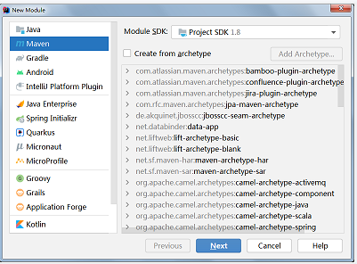 

Spring Boot 提供了一个名为 **spring-boot-starter-parent** 的工程，里面已经对各种常用依赖（并非全部）的版本进行了管理，我们的项目需要以这个项目为父工程，这样我们就不用操心依赖的版本问题了，需要什么依赖，直接引入坐标即可！

### 2.2 引入依赖

* **添加父工程坐标：**

~~~
<parent>
    <groupId>org.springframework.boot</groupId>
    <artifactId>spring-boot-starter-parent</artifactId>
    <version>2.3.6.RELEASE</version>
</parent>
~~~

* **添加 web 启动器：**

```
<dependency>
    <groupId>org.springframework.boot</groupId>
    <artifactId>spring-boot-starter-web</artifactId>
</dependency>
```

需要注意的是，我们并没有在这里指定版本信息。因为 Spring Boot 的 **父工程** 已经对版本进行了管理了，见后面讲解

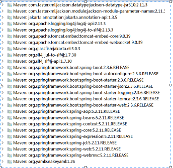 

这些都是 Spring Boot 根据 **`spring-boot-starter-web`** 这个依赖自动引入的，而且所有的版本都已经管理好，不会出现冲突。 

* **完整 pom 如下所示**

```
<?xml version="1.0" encoding="UTF-8"?>
<project xmlns="http://maven.apache.org/POM/4.0.0"
         xmlns:xsi="http://www.w3.org/2001/XMLSchema-instance"
         xsi:schemaLocation="http://maven.apache.org/POM/4.0.0 http://maven.apache.org/xsd/maven-4.0.0.xsd">
    <modelVersion>4.0.0</modelVersion>

    <parent>
        <groupId>org.springframework.boot</groupId>
        <artifactId>spring-boot-starter-parent</artifactId>
        <version>2.3.6.RELEASE</version>
    </parent>
    <groupId>org.example</groupId>
    <artifactId>springboot-demo</artifactId>
    <version>1.0-SNAPSHOT</version>

    <properties>
        <maven.compiler.source>8</maven.compiler.source>
        <maven.compiler.target>8</maven.compiler.target>
    </properties>
    <dependencies>
        <dependency>
            <groupId>org.springframework.boot</groupId>
            <artifactId>spring-boot-starter-web</artifactId>
        </dependency>
    </dependencies>
</project>
```

> 有时候，你不想，甚至是不能使用使用 spring-boot-starter-parent 作为你的父项目。例如，在父子模块项目中，你本身就有自己的父亲。这种情况下，你需要使用别的方式来使用 spring boot。见最后

### 2.3 编写类

SpringBoot 项目通过 *`main`* 函数即可启动，我们需要创建一个启动类：

~~~
@SpringBootApplication
public class SpringbootDemo1Application {
    public static void main(String[] args) {
        SpringApplication.run(SpringbootDemo1Application.class, args);
    }
}
~~~

接下来的编码工作，就是正常的 Spring MVC 项目的开发过程。

~~~
@RestController
public class HelloController {
    @GetMapping("/hello")
    public String helo() {
        return "hello world";
    }
}
~~~

运行启动类的 main 方法，会在控制台中看见日志信息，其中有一条信息如下：

~~~
Tomcat started on port(s): 8080 (http) with context path ''
~~~

说明：

1. 监听的默认端口是 8080
2. Spring MVC 的映射路径是：**`/`**
3. **`/hello`** 路径已经映射到了 ***`HelloController`*** 中的 *`hello()`* 方法
4. 打开页面访问：http://localhost:8080/hello


## 3.springboot启动原理

### 3.1 启动器分析1

为了让SpringBoot帮我们完成各种自动配置，我们必须引入SpringBoot提供的自动配置依赖，我们称为`启动器`。spring-boot-starter-parent工程将依赖关系声明为一个或者多个启动器，我们可以根据项目需求引入相应的启动器，因为我们是web项目，这里我们引入web启动器：

```xml
<dependencies>
    <dependency>
        <groupId>org.springframework.boot</groupId>
        <artifactId>spring-boot-starter-web</artifactId>
    </dependency>
</dependencies>
```

需要注意的是，我们并没有在这里指定版本信息。因为SpringBoot的父工程已经对版本进行了管理了。按住Ctrl点击pom.xml中的spring-boot-starter-web，跳转到了spring-boot-starter-web的pom.xml，xml配置如下（只摘抄了部分重点配置）：

```
<dependencies>
  <dependency>
    <groupId>org.springframework.boot</groupId>
    <artifactId>spring-boot-starter</artifactId>
    <version>2.3.6.RELEASE</version>
    <scope>compile</scope>
  </dependency>
  <dependency>
    <groupId>org.springframework.boot</groupId>
    <artifactId>spring-boot-starter-json</artifactId>
    <version>2.3.6.RELEASE</version>
    <scope>compile</scope>
  </dependency>
  <dependency>
    <groupId>org.springframework.boot</groupId>
    <artifactId>spring-boot-starter-tomcat</artifactId>
    <version>2.3.6.RELEASE</version>
    <scope>compile</scope>
  </dependency>
  <dependency>
    <groupId>org.springframework</groupId>
    <artifactId>spring-web</artifactId>
    <version>5.2.11.RELEASE</version>
    <scope>compile</scope>
  </dependency>
  <dependency>
    <groupId>org.springframework</groupId>
    <artifactId>spring-webmvc</artifactId>
    <version>5.2.11.RELEASE</version>
    <scope>compile</scope>
  </dependency>
</dependencies>
```

 可以发现该启动器引入了部分spring的相关jar

### 3.2 启动器分析2

按住Ctrl点击pom.xml中的spring-boot-starter-parent，跳转到了spring-boot-starter-parent的pom.xml重点配置）

```
<parent>
  <groupId>org.springframework.boot</groupId>
  <artifactId>spring-boot-dependencies</artifactId>
  <version>2.3.6.RELEASE</version>
</parent>
```

可以发现spring-boot-starter-parent的父工程又是spring-boot-dependencies，继续ctrl点击spring-boot-dependencies，发现这个spring-boot-dependencies工程里面定义了很多jar的版本锁定以及引入了很多的jar。所以我们的SpringBoot工程继承spring-boot-starter-parent后就已经具备版本锁定等配置了。所以起步依赖的作用就是进行依赖的传递

### 3.3 启动流程分析3

**注解@SpringBootApplication**

~~~
@SpringBootApplication
public class TestApplication {

    public static void main(String[] args) {
        SpringApplication.run(TestApplication.class, args);
    }
}
~~~

发现@SpringBootApplication其实是一个组合注解，这里重点的注解有3个：

- @SpringBootConfiguration 可以简单的理解为就是一个@Configuration注解，通过@Configuration 与 @Bean结合，将Bean注册到Spring ioc 容器

  * 标注这个类是一个配置类

  * 它只是@Configuration注解的派生注解
  * 它与@Configuration注解的功能一致
  * 只不过@SpringBootConfiguration是springboot的注解，而@Configuration是spring的注解

- @ComponentScan：开启注解扫描：默认扫描@SpringBootApplication所在类的同级目录以及它的子目录

  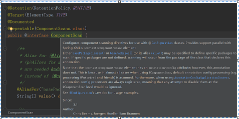 

  大概的意思：

  > 配置组件扫描的指令。提供了类似与`<context:component-scan>`标签的作用
  >
  > 通过basePackageClasses或者basePackages属性来指定要扫描的包。如果没有指定这些属性，那么将从声明这个注解的类所在的包开始，扫描包及子包

  而我们的@ComponentScan注解声明的类就是main函数所在的启动类，因此扫描的包是该类所在包及其子包。一般启动类会放在一个比较浅的包目录中

- @EnableAutoConfiguration：开启spring应用程序的自动配置，SpringBoot基于你所添加的依赖和你自己定义的bean，试图去猜测并配置你想要的配置。比如我们引入了`spring-boot-starter-web`，而这个启动器中帮我们添加了`tomcat`、`SpringMVC`的依赖。此时自动配置就知道你是要开发一个web应用，所以就帮你完成了web及SpringMVC的默认配置了！

  ~~~
  @Import({AutoConfigurationImportSelector.class})
  public @interface EnableAutoConfiguration {
      String ENABLED_OVERRIDE_PROPERTY = "spring.boot.enableautoconfiguration";
      Class<?>[] exclude() default {};
      String[] excludeName() default {};
  }
  ~~~
  
  该注解引入了AutoConfigurationImportSelector.class这个类，在该类中有如下方法，启动时会调用该方法

  ```
protected List<String> getCandidateConfigurations(AnnotationMetadata metadata, AnnotationAttributes attributes) {
      List<String> configurations = SpringFactoriesLoader.loadFactoryNames(this.getSpringFactoriesLoaderFactoryClass(), this.getBeanClassLoader());
      Assert.notEmpty(configurations, "No auto configuration classes found in META-INF/spring.factories. If you are using a custom packaging, make sure that file is correct.");
      return configurations;
  }
  ```
  
  可以看到该方法内部调用了loadFactoryNames（），该方法是获取配置类下的全限定名，它会去spring-boot-autoconfigure:2.3.6里面找META-INF/spring.factories，这个文件里就是大量配置类的全限定名

  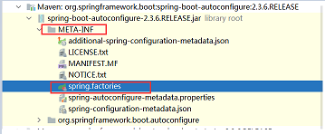 

  这些配置类路径在springboot启动时，通过反射创建配置类对象并且由spring的IOC容器来管理，当然我们也可以关闭某些配置类，在springboot启动时，这些配置类不加载

  ~~~
@SpringBootApplication(exclude = {RedisAutoConfiguration.class, ActiveMQAutoConfiguration.class})
  public class TestApplication {
  
      public static void main(String[] args) {
          SpringApplication.run(TestApplication.class,args);
      }
  }
  ~~~


### 3.4 默认配置类分析

1、以我们熟悉的WebMvcAutoConfiguration配置类为例

 

```
@Configuration(
    proxyBeanMethods = false
)
@ConditionalOnWebApplication(
    type = Type.SERVLET
)
@ConditionalOnClass({Servlet.class, DispatcherServlet.class, WebMvcConfigurer.class})
@ConditionalOnMissingBean({WebMvcConfigurationSupport.class})
@AutoConfigureOrder(-2147483638)
@AutoConfigureAfter({DispatcherServletAutoConfiguration.class, TaskExecutionAutoConfiguration.class, ValidationAutoConfiguration.class})
public class WebMvcAutoConfiguration {
    public static final String DEFAULT_PREFIX = "";
    public static final String DEFAULT_SUFFIX = "";
    private static final String[] SERVLET_LOCATIONS = new String[]{"/"};
    ........
}
```

我们看到这个类上的4个注解：

- `@Configuration`：声明这个类是一个配置类

- `@ConditionalOnWebApplication(type = Type.SERVLET)`

  ConditionalOn，翻译就是在某个条件下，此处就是满足项目的类是Type.SERVLET类型，也就是一个普通web工程，显然我们就是

- `@ConditionalOnClass({ Servlet.class, DispatcherServlet.class, WebMvcConfigurer.class })`

  这里的条件是OnClass，也就是满足以下类存在：Servlet、DispatcherServlet、WebMvcConfigurer，其中Servlet只要引入了tomcat依赖自然会有，后两个需要引入SpringMVC才会有。这里就是判断你是否引入了相关依赖，引入依赖后该条件成立，当前类的配置才会生效！

- `@ConditionalOnMissingBean(WebMvcConfigurationSupport.class)`

  这个条件与上面不同，OnMissingBean，是说环境中没有指定的Bean这个才生效。其实这就是自定义配置的入口，也就是说，如果我们自己配置了一个WebMVCConfigurationSupport的类，那么这个默认配置就会失效！

2、WebMvcAutoConfiguration类定义相关的方法，这里只说明部分方法

* 定义视图解析器（解析jsp的视图解析器）

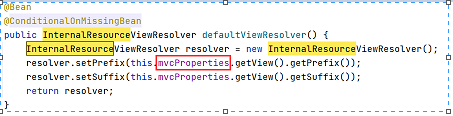 

* 处理器适配器

~~~
 @Bean
public RequestMappingHandlerAdapter requestMappingHandlerAdapter(@Qualifier("mvcContentNegotiationManager") ContentNegotiationManager contentNegotiationManager, @Qualifier("mvcConversionService") FormattingConversionService conversionService, @Qualifier("mvcValidator") Validator validator) {
            RequestMappingHandlerAdapter adapter = super.requestMappingHandlerAdapter(contentNegotiationManager, conversionService, validator);
            adapter.setIgnoreDefaultModelOnRedirect(this.mvcProperties == null || this.mvcProperties.isIgnoreDefaultModelOnRedirect());
            return adapter;
}
~~~

1)  this.mvcProperties属性：

这写方法都用到了this.mvcProperties属性，通过查看该属性是WebMvcProperties类型

```
@ConfigurationProperties(
    prefix = "spring.mvc"
)
public class WebMvcProperties {

	...........
	public static class View {
        private String prefix;
        private String suffix;

        public View() {
        }
        ..........
    }
}
//可以在springboot全局配置文件application里面去定义属性值，如spring.mvc.prefix = 前缀路径 spring.mvc.suffix= 后缀名
```

2) this.resourceProperties属性，定义了静态资源的位置

```
@ConfigurationProperties(
    prefix = "spring.resources",
    ignoreUnknownFields = false
)
public class ResourceProperties {
    private static final String[] CLASSPATH_RESOURCE_LOCATIONS = new String[]{"classpath:/META-INF/resources/", "classpath:/resources/", "classpath:/static/", "classpath:/public/"};
    private String[] staticLocations;
```

> 更多全局属性，参考当前SpringBoot全局属性笔记

## 4.properties 和 yml

Spring Boot 整个应用程序只有一个配置文件，那就是 **`.properties`** 或 **`.yml`** 文件。如果你的 Spring Boot 项目中没有包含这个配置文件，Spring Boot 对每个配置项都有默认值（当然，我们也可以添加配置文件，用以覆盖其默认值）。

这里以 **`.properties`** 文件为例，首先在 **`resources`** 下新建一个名为 **`applicatioon.properties`**（**必须是这个名字**）的文件。

内容为：

```properties
server.port=8081
server.servlet.context-path=/aaa
```

并且启动 main 方法，这时程序请求地址则变成了：**`http://localhost:8081/aaa/hello`** 。

Spring Boot 支持 .properties 和 .yml 两种格式的文件，文件名分别对应 **`application.properties`** 和 **`application.yml`** 。

下面贴出 yaml 文件格式供大家参考：

```yaml
server:
    port: 8080
    servlet:
        context-path: /aaa
```

可以看出 yml 则 **`换行 + tab`** 隔开。这里需要注意的是冒号后面 **必须有空格**，否则会报错

## 5.springboot日志配置

Spring Boot 直接使用 slf4j ，默认间接使用 logback 日志，因此，它支持直接在 **`.properties`** 和 **`.yml`** 文件中对日志的相关信息进行配置。另外，Spring Boot 还支持控制台日志上色功能。

```properties
logging.level.root=INFO
logging.level.com.woniu.dao=DEBUG
logging.pattern.console=${CONSOLE_LOG_PATTERN:%clr(${LOG_LEVEL_PATTERN:%5p}) %clr([%15.15t]){faint} %clr(%-40.40logger{39}){cyan} %clr(:){faint} %m%n${LOG_EXCEPTION_CONVERSION_WORD:%wEx}}
logging.file=D:/mylog/log.log
```

采用application.yml

~~~
logging:
  level:
    root: DEBUG
  pattern:
    console: ${CONSOLE_LOG_PATTERN:%clr(${LOG_LEVEL_PATTERN:%5p}) %clr([%15.15t]){faint}
      %clr(%-40.40logger{39}){cyan} %clr(:){faint} %m%n${LOG_EXCEPTION_CONVERSION_WORD:%wEx}}
~~~

> 可以在idea中安装插件 Convert YAML and Properties File


## 6.springboot属性注入

### 6.1 Spring 配置类注解回顾

从 Spring 3.0 开始，Spring 官方就推荐大家使用 java 代码配置来代替以前的 xml 文件配置。而到了 SpringBoot，Java 代码配置更是成了标配。Java 代码配置主要靠 Java 类和一些注解，比较常用的注解有：

| 常用注解        | 说明                                                         |
| :-------------- | :----------------------------------------------------------- |
| @Configuration  | 声明一个类作为配置类，代替 *`.xml`* 文件                     |
| @Bean           | 声明在方法上，将方法的返回值加入Bean容器，代替 *`<bean>`* 标签 |
| @Value          | 属性注入                                                     |
| @PropertySource | 指定外部属性文件                                             |

### 6.2  配置druid数据源案例

1、添加相关的依赖

~~~
<dependency>
      <groupId>mysql</groupId>
      <artifactId>mysql-connector-java</artifactId>
</dependency>

<dependency>
    <groupId>org.springframework.boot</groupId>
    <artifactId>spring-boot-starter-jdbc</artifactId>
</dependency>

<dependency>
    <groupId>com.alibaba</groupId>
    <artifactId>druid-spring-boot-starter</artifactId>
    <version>1.1.10</version>
</dependency>
~~~

2、添加外部属性文件:jdbc.properties

~~~
jdbc.driverClassName=com.mysql.jdbc.Driver
jdbc.url=jdbc:mysql://localhost:3306/woniu-shopping?serverTimezone=UTC
jdbc.username=root
jdbc.password=123
~~~

3、编写配置类: DruidDataSourceConfig

```
@Configuration
@PropertySource("classpath:jdbc.properties")
public class DruidDataSourceConfig {

    @Value("${jdbc.url}")
    String url;
    @Value("${jdbc.driverClassName}")
    String driverClassName;
    @Value("${jdbc.username}")
    String username;
    @Value("${jdbc.password}")
    String password;
    @Bean
    public DruidDataSource dataSource() {
        DruidDataSource dataSource = new DruidDataSource();
        dataSource.setUrl(url);
        dataSource.setDriverClassName(driverClassName);
        dataSource.setUsername(username);
        dataSource.setPassword(password);
        return dataSource;
    }
}
```

4、controller获取druid数据源

```
@Autowired
private DruidDataSource dataSource;
@RequestMapping("/hello")
public String hello(){
    System.out.println(dataSource.getUrl());
    return "world";
}
```


### 6.3 SpringBoot的属性注入

在上面的案例中，我们实验了java配置方式。不过属性注入使用的是@Value注解。这种方式虽然可行，但是不够强大，因为它只能注入基本类型值。在SpringBoot中，提供了一种新的属性注入方式，支持各种java基本数据类型及复杂类型的注入。

#### @ConfigurationProperties普通注入

该注解为属性注值，**该注解声明当前类为属性读取类**

编写application.properties配置文件

```
jdbc.driverClassName=com.mysql.jdbc.Driver
jdbc.url=jdbc:mysql://localhost:3306/woniu-shopping?serverTimezone=UTC
jdbc.username=root
jdbc.password=123
```

添加属性类：JdbcProperties

~~~
@Component
@ConfigurationProperties(prefix = "jdbc")  //根据前缀去springboot配置文件找对应的属性值
@Data
public class JdbcProperties {  //属性必须具有getter和setter方法
    private String url;
    private String driverClassName;
    private String username;
    private String password;
}
~~~

编写配置类

```
@Configuration 
public class DruidDataSourceConfig {
    @Autowired
    private JdbcProperties jdbcProperties;
    @Bean
    public DruidDataSource dataSource() {
        DruidDataSource dataSource = new DruidDataSource();
        dataSource.setUrl(jdbcProperties.getUrl());
        dataSource.setDriverClassName(jdbcProperties.getDriverClassName());
        dataSource.setUsername(jdbcProperties.getUsername());
        dataSource.setPassword(jdbcProperties.getPassword());
        return dataSource;
    }
}
```

#### @ConfigurationProperties更优雅的注入

我们直接把`@ConfigurationProperties(prefix = "jdbc")`声明在需要使用的`@Bean`的方法上，然后SpringBoot就会自动调用这个Bean（此处是DataSource）的set方法，然后完成注入。使用的前提是：**该类必须有对应属性的set方法！**

编写application.properties配置文件

编写application.properties 

```
jdbc.driverClassName=com.mysql.jdbc.Driver
jdbc.url=jdbc:mysql://localhost:3306/woniu-shopping?serverTimezone=UTC
jdbc.username=root
jdbc.password=123
```

编写配置类

```
@Configuration
public class DruidDataSourceConfig {
    /*
     prefix:声明要注入的属性前缀，SpringBoot调用该方法创建对象时 
     根据前缀去application配置文件中找对应的属性，然后把属性的值注入给对象的同名属性
     */
    // 对应该类（datasource）
    @Bean
    @ConfigurationProperties(prefix = "jdbc")
    public DruidDataSource dataSource() {
        DruidDataSource dataSource = new DruidDataSource();
        return dataSource;
    }
}
```


# 二 SpringBoot实战

## 1.SpringBoot 整合 Mybatis

### 1.1 MyBatis-Spring-Boot-Starter

`mybatis-spring-boot-starter` 是 MyBatis 帮助我们快速集成 SpringBoot 提供的一个组件包，使用这个组件可以做到以下几点：

* 自动检测现有的DataSource
* 将创建并注册SqlSessionFactory的实例，该实例使用SqlSessionFactoryBean将该DataSource作为输入进行传递，将创建并注册从SqlSessionFactory中获取的SqlSessionTemplate的实例。
* 自动扫描您的mappers，将它们链接到SqlSessionTemplate并将其注册到Spring上下文，以便将它们注入到您的bean中

使用了该Starter之后，只需要定义一个DataSource即可（application.properties或application.yml中可配置），它会自动创建使用该DataSource的SqlSessionFactoryBean以及SqlSessionTemplate。会自动扫描你的Mappers，连接到SqlSessionTemplate，并注册到Spring上下文中

### 1.2 spring-boot-starter-jdbc

从 Spring Boot 2.0 开始，spring-boot-starter-jdbc内部提供了默认的 HikariCP 数据库连接池，（也是传说中最快的数据库连接池）。`spring-boot-starter-jdbc`主要提供了三个功能，第一个就是对数据源的装配，第二个就是提供一个JdbcTemplate简化使用，第三个就是事务

### 1.3 SpringBoot 整合 Mybatis

#### 1 关键依赖包

~~~
<parent>
    <groupId>org.springframework.boot</groupId>
    <artifactId>spring-boot-starter-parent</artifactId>
    <version>2.3.6.RELEASE</version>
</parent>

<dependencies>
    <dependency>
        <groupId>org.springframework.boot</groupId>
        <artifactId>spring-boot-starter-web</artifactId>
    </dependency>
    <dependency>
        <groupId>mysql</groupId>
        <artifactId>mysql-connector-java</artifactId>
    </dependency>
    <dependency>
        <groupId>org.springframework.boot</groupId>
        <artifactId>spring-boot-starter-jdbc</artifactId>
    </dependency>
    <dependency>
        <groupId>org.mybatis.spring.boot</groupId>
        <artifactId>mybatis-spring-boot-starter</artifactId>
        <version>2.1.4</version>
    </dependency>
</dependencies>
~~~

#### 2 application 配置

application.properties：

```properties
spring.datasource.type=com.zaxxer.hikari.HikariDataSource
##如果是mysql8版本: spring.datasource.driver-class-name=com.mysql.cj.jdbc.Driver
spring.datasource.driver-class-name=com.mysql.jdbc.Driver
spring.datasource.url=jdbc:mysql://localhost:3306/scott?useUnicode=true&characterEncoding=utf-8\
    &useSSL=true\
    &serverTimezone=UTC
##spring.datasource.url=jdbc:mysql://localhost:3306/smbms
spring.datasource.username=root
spring.datasource.password=root
## jdbc-starter 中自带了一个连接池：HikariCP
spring.datasource.hikari.idle-timeout=60000
spring.datasource.hikari.maximum-pool-size=30
spring.datasource.hikari.minimum-idle=10

##加载mybatis全局配置文件，注意： 放到resources目录下
mybatis.config-location=classpath:mybatis-config.xml
##加载mybatis的映射文件，則不需要，如果resources下mybatis映射文件和dao接口同包同名，下面這句可以省略
mybatis.mapper-locations=classpath:com/woniu/dao/*.xml
##mybatis的po实体类的别名     ##如果dao接口是注解形式，那么就不要定义别名
mybatis.type-aliases-package=com.woiniu.entity 

logging.level.com.woniu.dao = debug
```

在resources创建一次创建多个文件夹来放映射文件，不能用com.woniu.dao. 要用com/woniu/dao

如果你需要使用 Druid 连接池，也可以使用 Druid 官方提供的启动器：

#### 3 使用druid启动器

```
 <dependency>
     <groupId>org.springframework.boot</groupId>
     <artifactId>spring-boot-starter-web</artifactId>
 </dependency>
 <dependency>
     <groupId>mysql</groupId>
     <artifactId>mysql-connector-java</artifactId>
 </dependency>
<dependency>
    <groupId>com.alibaba</groupId>
    <artifactId>druid-spring-boot-starter</artifactId>
    <version>1.1.10</version>
</dependency>
  <dependency>
      <groupId>org.mybatis.spring.boot</groupId>
      <artifactId>mybatis-spring-boot-starter</artifactId>
      <version>2.1.4</version>
  </dependency>

```

> 如果使用druid啟動器（內部使用druid數據源），那麼就不需要spring-boot-starter-jdbc啟動器了。

配置文件修改成如下：

```
spring.datasource.type=com.alibaba.druid.pool.DruidDataSource
spring.datasource.druid.driver-class-name=com.mysql.jdbc.Driver
spring.datasource.druid.url=jdbc:mysql://localhost:3306/smbms?useUnicode=true&characterEncoding=utf-8\
    &useSSL=true\
    &serverTimezone=UTC

spring.datasource.druid.username=root
spring.datasource.druid.password=root

##加载mybatis全局配置文件，注意： 放到resources目录下
mybatis.config-location=classpath:mybatis-config.xml
##加载mybatis的映射文件
mybatis.mapper-locations=classpath:com/woniu/dao/*.xml
##mybatis的po实体类的别名     ##如果dao接口是注解形式，那么就不要定义别名
mybatis.type-aliases-package=com.woiniu.entity 
........
```

#### 4 启动类

在启动类中添加对 dao包扫描 ***@MapperScan***，SpringBoot 启动的时候会自动加载包路径下的接口，并为这些接口创建代理对象

```java
@SpringBootApplication
@MapperScan("com.woniu.dao")
public class Application {
    public static void main(String[] args) {
        SpringApplication.run(Application.class, args);
    }
}
```

或者直接在 Mapper/DAO 类上面添加注解 `@Mapper`，建议使用上面那种，不然每个 mapper 加个注解也挺麻烦的。

> 如果使用的是 Idea，注入 DAO 时经常会报 `could not autowire`，Eclipse 却没有问题，其实代码是正确的，这是 Idea 的误报。可以选择降低 Autowired 检测的级别，不要提示就好。 在 File | Settings | Editor | Inspections 选项中使用搜索功能找到 `Autowiring for Bean Class`，将 Severity 的级别由之前的 error 改成 warning 即可

## 2.springboot整合事务

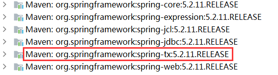 

直接在相关的业务类上添加@Transactional注解即可


## 3.springboot整合tkmapper

通用Mapper的作者也为自己的插件编写了启动器，我们直接引入即可

```
<dependency>
    <groupId>tk.mybatis</groupId>
    <artifactId>mapper-spring-boot-starter</artifactId>
    <version>2.1.5</version>
</dependency>
```

1、dao接口

~~~
public interface UserMapper extends tk.mybatis.mapper.common.Mapper<User>{
}
~~~

2、实体类

~~~
@Table("k15_course")  //当前该类把哪个表相对应
@NameStyle(Style.normal) //默认情况下，如果属性采用驼峰命名，那么对应的列中间会添加下划线，Style.normal则不会添加下划线
public class Course {
    @Id
    @GeneratedValue(strategy = GenerationType.IDENTITY)  //和数据库id主键列对应，主键自增长
    private Integer id;
    @Column(name = "name",insertable = false,updatable = false) //该属性对应的类不允许更新和插入数据
    private String name;
    @Transient  //该属性不需要和数据库表的列对应，会被忽略
    private String cover;
}
    
~~~

3、启动类

```
import tk.mybatis.spring.annotation.MapperScan;
@SpringBootApplication
@MapperScan("com.woniu.dao")
public class AppTest {

}
```

>  tk.mybatis.spring.annotation.MapperScan 主要这个注解所在的包，也可以在dao接口直接加@Mapper注解，同样要注意该注解的包名


## 4. springboot整合jsp（了解）

在 Spring Boot 项目中不是不可以使用 JSP 。想在 Spring Boot 中使用 JSP，需要满足一些特殊要求

### 4.1 引入jsp的相关依赖

```
<dependency>
  <groupId>org.springframework.boot</groupId>
  <artifactId>spring-boot-starter-web</artifactId>
</dependency>
<!-- jstl -->
<dependency>
    <groupId>javax.servlet</groupId>
    <artifactId>jstl</artifactId>
</dependency>
<!-- jasper jsp 的支持. 用于编译jsp-->
<dependency>
    <groupId>org.apache.tomcat.embed</groupId>
    <artifactId>tomcat-embed-jasper</artifactId>
</dependency>

<!-- servlet 依赖. -->
<dependency>
    <groupId>javax.servlet</groupId>
    <artifactId>javax.servlet-api</artifactId>
    <scope>provided</scope>
</dependency>
```

- **spring-boot-starter-web** 包依赖了 **spring-boot-starter-tomcat**，因此，后者不再需要单独配置；
- **jstl** 是一个 JSP 的 jstl 标签库；
- **tomcat-embed-jasper** 主要用来支持 JSP 的解析和运行

### 4.2 修改配置文件

~~~
spring.mvc.view.prefix=/WEB-INF/jsp/
spring.mvc.view.suffix=.jsp
~~~

- **spring.mvc.view.prefix** 指明 jsp 文件在 webapp 下的哪个目录
- **spring.mvc.view.suffix** 指明 jsp 以什么样的后缀结尾

### 4.3 项目目录结构

Spring Boot 项目想要支持 JSP，其项目结构必须如下：

```xml
spring-boot-jsp
│── pom.xml
└── src
    ├── main
    │   ├── java
    │   ├── resouces
    │   └── webapp
    │       └── WEB-INF
    │           └── jsp
    │               └── welcome.jsp
    └── test
```

在main目录下新建webapp，然后在webapp下新建WEB-INF，然后在WEB-INF下创建jsp文件夹，同时把web.xml拷贝到WEB-INF下。把我们自己创建的jsp页面放到 webapp\WEB-INF\jsp目录里面。如下图所示

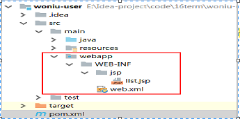 

### 4.5 webapp下的web.xml

```
<!DOCTYPE web-app PUBLIC
 "-//Sun Microsystems, Inc.//DTD Web Application 2.3//EN"
 "http://java.sun.com/dtd/web-app_2_3.dtd" >

<web-app>
  <display-name>Archetype Created Web Application</display-name>
</web-app>
```

### 4.6 编写页面和后台

list.jsp页面

~~~
<%@ page contentType="text/html;charset=UTF-8" language="java" %>
<%@ taglib prefix="c" uri="http://java.sun.com/jsp/jstl/core" %>
<html>
<head>
    <title>Title</title>
</head>
<body>
    <table  border="1" align="center" width="50%">
        <tr>
            <th>ID</th>
            <th>userCode</th>
            <th>userName</th>
        </tr>
        <c:forEach items="${users}" var="user">
            <tr>
                <td>${user.id }</td>
                <td>${user.userCode }</td>
                <td>${user.userName }</td>
            </tr>
        </c:forEach>
    </table>
</body>
</html>
~~~

登陆页面简单设计

~~~
<%@ page contentType="text/html;charset=UTF-8" language="java" %>
<%@ taglib prefix="c" uri="http://java.sun.com/jsp/jstl/core" %>
<html>
<head>
    <title>Title</title>
    <link rel="stylesheet" href="${pageContext.request.contextPath}/resource/css/1.css">
    <script src="${pageContext.request.contextPath}/resource/js/hello.js"></script>
</head>
<body>

<form action="login">

    
    <p>用户名 <input type="text" name="username"></p>
    <p>密码 <input type="text" name="password"></p>
    <p>密码 <input type="submit" value="提交"></p>
</form>
</body>
</html>
~~~

> 静态资源的存放位置

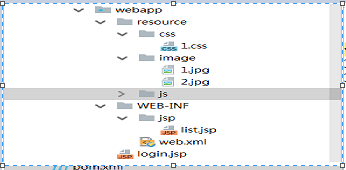 

浏览器访问http://localhost:8080/login.jsp 即可，当然我们也可以在controller中添加控制方法login，转发或者重定向到login.jsp页面

~~~
@Controller
public class UserController {

    @Autowired
    private UserService userService;
    @RequestMapping("/users")
    public Object queryUserById(Model model){
        List<User> users = this.userService.showUsers();
        model.addAttribute("users",users);
        return "list";
    }

    @RequestMapping("/login")
    public Object login(Model model){
        return "forward:/login.jsp";
    }
}
~~~

### 4.7 修改webapp目录结构

点击file选择Project Structure选择Modules----Web---点击+，选择路径为创建的webapp目录,然后点击Create Artifact点击appliy

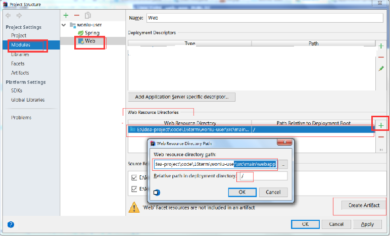 

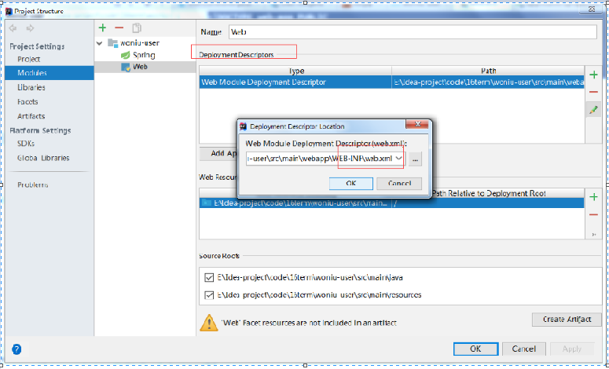 


### 4.8 项目启动

1 直接通过main方法来启动

如果像其他项目一样，直接在 IDEA 中通过 main 方法来启动项目，有时候在访问测试的时候会出现 `404 not found` 。这个可能是springboot整合jsp的版本的原因

这是因为 Spring Boot JSP 项目需要额外进行一个设置：选择 `Edit Configurations` 选项，打开 `Configuration`，为 `Working directory` 赋值为项目的根目录

 

2 添加springboot插件来启动

~~~
<build>
    <plugins>
        <plugin>
        <groupId>org.springframework.boot</groupId>
        <artifactId>spring-boot-maven-plugin</artifactId>
        <version>1.4.2.RELEASE</version>
        </plugin>
    </plugins>
</build>
~~~

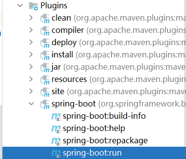 


## 5.springboot整合thymeleaf

简单说， Thymeleaf 是一个跟 Velocity、FreeMarker 类似的模板引擎，它可以完全替代 JSP 。相较于其他的模板引擎，它有如下四个极吸引人的特点：

- 动静结合：Thymeleaf 在有网络和无网络的环境下皆可运行，即它可以让美工在浏览器查看页面的静态效果，也可以让程序员在服务器查看带数据的动态页面效果。这是由于它支持 html 原型，然后在 html 标签里增加额外的属性来达到模板+数据的展示方式。浏览器解释 html 时会忽略未定义的标签属性，所以 thymeleaf 的模板可以静态地运行；当有数据返回到页面时，Thymeleaf 标签会动态地替换掉静态内容，使页面动态显示。
- 开箱即用：它提供标准和spring标准两种方言，可以直接套用模板实现JSTL、 OGNL表达式效果，避免每天套模板、改jstl、改标签的困扰。同时开发人员也可以扩展和创建自定义的方言。
- 多方言支持：Thymeleaf 提供spring标准方言和一个与 SpringMVC 完美集成的可选模块，可以快速的实现表单绑定、属性编辑器、国际化等功能。
- 与SpringBoot完美整合，SpringBoot提供了Thymeleaf的默认配置，并且为Thymeleaf设置了视图解析器，我们可以像以前操作jsp一样来操作Thymeleaf。代码几乎没有任何区别，就是在模板语法上有区别

### 5.1 快速上手

1、添加启动器

```xml
<dependency>
    <groupId>org.springframework.boot</groupId>
    <artifactId>spring-boot-starter-thymeleaf</artifactId>
</dependency>
```

2、配置application.properties

```properties
server.port=80
server.servlet.context-path=/
spring.datasource.username=root
spring.datasource.url=jdbc:mysql://localhost:3306/k15?useUnicode=true&characterEncoding=utf-8&useSSL=true&serverTimezone=UTC
spring.datasource.password=root
spring.datasource.driver-class-name=com.mysql.jdbc.Driver
#关闭thymeleaf缓存
spring.thymeleaf.cache=false
spring.thymeleaf.prefix = classpath:/templates/ ＃在构建URL时预先查看名称的前缀。 
spring.thymeleaf.suffix = .html ＃构建URL时附加到查看名称的后缀。 

logging.level.root=INFO
logging.level.xxx.yyy.zzz=DEBUG
logging.pattern.console=${CONSOLE_LOG_PATTERN:\
  %clr(${LOG_LEVEL_PATTERN:%5p}) \
  %clr(|){faint} \
  %clr(%-40.40logger{39}){cyan} \
  %clr(:){faint} \
  %m%n${LOG_EXCEPTION_CONVERSION_WORD:%wEx}}
```

> 关闭 Thymeleaf 的缓存。不然在开发过程中修改页面不会立即生效需要重启，生产可配置为 **true** 

3、页面设计list.html 放到resources的templates目录下

```html
<!DOCTYPE html>
<html lang="en" xmlns:th="http://www.thymeleaf.org">
<head>
    <meta charset="UTF-8"/>
    <title>Hello</title>
</head>
<body>
   <div style="text-align: center">
    <span style="color: darkslategray; font-size: 30px">欢迎光临！</span>
    <hr/>
    <table class="list"> 
        <tr th:each="user : ${users}">
            <td th:text="${user.id}"></td>
            <td th:text="${user.userName}"></td> 
        </tr>
    </table>
</div>
</html>
```

> 所有使用 Thymeleaf 的页面『**必须**』在 HTML 标签声明 Thymeleaf：

```html
<html xmlns:th="http://www.thymeleaf.org">
```

表明页面使用的是 Thymeleaf 语法。否则，开发工具会认为你在 html 中缩写的 `th:` 是语法错误

4、controller返回数据集合

~~~html
@RequestMapping("/hello")
public Object hello(Model model){
	List<User> users = userDao.findUsers();
    model.addAttribute("users",users);
    return "list";  //这是一个逻辑视图名
}
~~~

### 5.2  thymeleaf添加静态资源

查看ResourceProperties类，静态资源存放的默认位置由4个目录，分别在根目录，即/src/main/resources/目录下的/META-INF/resources/、/resources/、/static/、/public/目录下（优先级也是这个顺序）

```
public class ResourceProperties {
    private static final String[] CLASSPATH_RESOURCE_LOCATIONS = new String[]{"classpath:/META-INF/resources/", "classpath:/resources/", "classpath:/static/", "classpath:/public/"};
}
```

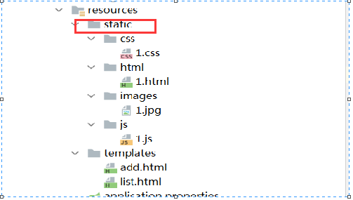 

add.html页面添加资源

```
<!DOCTYPE html>
<html lang="en" xmlns:th="http://www.thymeleaf.org">
<head>
    <meta charset="UTF-8"/>
    <title>Hello</title>

    <script src="/js/1.js"></script>
    <link rel="stylesheet" href="/css/1.css">
</head>
<body>
<div style="text-align: center">
    <p>hello world</p>
    
</div>
```

> 注意：不能在资源路径前面添加static，默认会去static里面找


动态获取项目名：

~~~
<base th:href="${#request.getContextPath()}+'/'"> 
~~~

add.html修改如下，不再在引用资源的路径前面添加 /

~~~
<!DOCTYPE html>
<html lang="en" xmlns:th="http://www.thymeleaf.org">
<head>
	<base th:href="${#request.getContextPath()}+'/'">
    <meta charset="UTF-8"/>
    <title>Hello</title>

    <script src="js/1.js"></script>
    <link rel="stylesheet" href="css/1.css">
</head>
<body>
<div style="text-align: center">
    <p>hello world</p>
    
</div>
~~~

浏览器测试： http://localhost:8080/add    通过后台逻辑视图名 接上前后缀  进入 add.html

> 说明：如果把静态资源放到resources根目录下的其它的项目路径，如：放到  /resources/static1/目录里，那么需要在application.properties中配置，除了去默认的位置找外，还会去static1目录下找静态资源。
>
> spring.resources.static-locations=classpath:/META-INF/resources/,classpath:/resources/, classpath:/static/,classpath:/public/,classpath:/static1/


### 5.3 视图解析器

当我们引入SpringBoot会自动为Thymeleaf注册一个视图解析器

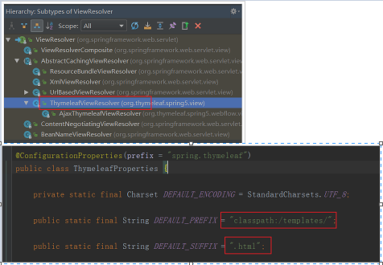 

- 默认前缀：`classpath:/templates/`
- 默认后缀：`.html`

所以如果我们返回视图：list，会指向到 classpath:/templates/list.html，一般我们无需进行修改，默认即可。

1、返回逻辑视图名

```
@RequestMapping("/add")
public String add(){
    return "add";
}
```

默认情况下：这是一个逻辑视图名，自动在视图名的前面添加  classpath:templates，在视图名的后面添加.html,其实最终返回的 物理视图位置是 classpath:templates/add.html

2、重定向指示符：redirect

```
@RequestMapping("/list")
public String hello(Model model){
    List<User> users = userDao.findUsers();
    model.addAttribute("users",users);
    return "list";
}

@RequestMapping("/add")
public String add(){
    return "redirect:/list";
}
```

3、转发指示符：forward

```
@RequestMapping("/list")
public String hello(Model model){
    List<User> users = userDao.findUsers();
    model.addAttribute("users",users);
    return "forward:/list.html";
}
```

> 1、返回一个真正的物理视图名，不接上前后缀，springboot会把这个list.html作为一个静态资源。那么就会去/META-INF/resources/", "classpath:/resources/", "classpath:/static/", "classpath:/public/找，找不到该list.html页面就报错，如果要想去templates目录下找，那么把这个templates作为查找目标即可
>
> ```
> spring.resources.static-locations=classpath:/META-INF/resources/,classpath:/resources/, \
>   classpath:/static/,classpath:/public/,classpath:/templates/
> ```

~~~
@RequestMapping("/list")
public String hello(Model model){
    List<User> users = userDao.findUsers();
    model.addAttribute("users",users);
    return "forward:/templates/list.html";
}
~~~

> 如果返回值直接写成 return "forward:/templates/list.html“,那么还是会去/META-INF/resources/", "classpath:/resources/", "classpath:/static/", "classpath:/public/目录下找是否有templates目录。目录里面是否有list.html

**更多thymeleaf语法标签，参考thymeleaf语法详解**

## 6.springboot定义拦截器

1、拦截器MyHandlerInterceptor 类实现HandlerInterceptor

```
public class MyHandlerInterceptor implements HandlerInterceptor {
    @Override
    public boolean preHandle(HttpServletRequest httpServletRequest, HttpServletResponse httpServletResponse, Object o)
            throws Exception {
        System.out.println("== preHandle ==");
        return true;
    }
    @Override
    public void postHandle(HttpServletRequest httpServletRequest, HttpServletResponse httpServletResponse, 
                           Object o, ModelAndView modelAndView) throws Exception {
        System.out.println("== postHandle ==");
    }
    @Override
    public void afterCompletion(HttpServletRequest httpServletRequest, HttpServletResponse httpServletResponse, 
                                Object o, Exception e) throws Exception {
        System.out.println("== afterCompletion ==");
    }
}
```

2、配置拦截器

```
@Configuration
public class WebConfiguration implements  WebMvcConfigurer {
    @Override
    public void addInterceptors(InterceptorRegistry registry) {
        registry.addInterceptor(new MyHandlerInterceptor())
                .addPathPatterns("/**")
                .excludePathPatterns("/", "/login");
    }
}
```


## 7.springboot集成消息转换器

使用fastjson作为Springboot的HttpMessageConverter,即在Web中返回@ResponseBody时使用的将对象、集合等转为Json的转换器

1、在maven中添加依赖

```
<dependency>
    <groupId>com.alibaba</groupId>
    <artifactId>fastjson</artifactId>
    <version>1.2.15</version>
</dependency>
```

2、添加配置类，注册HttpMessageConverters的Bean对象即可

```
@Configuration
public class HttpMessageConvertsConfig {
    @Bean
    public HttpMessageConverters fastJsonHttpMessageConverter() {
        //使用FastJson作为HTTP的序列换和反序列工具
        // 1.定义Converter转换器对象
        FastJsonHttpMessageConverter converter = new FastJsonHttpMessageConverter();
        // 2.1设置转换器的配置信息
        FastJsonConfig config = new FastJsonConfig();
        config.setSerializerFeatures(
                //List字段如果为null,输出为[],而非null
                SerializerFeature.WriteNullListAsEmpty,
                //字符类型字段如果为null,输出为"",而非null
                // SerializerFeature.WriteNullStringAsEmpty,
                //Boolean字段如果为null,输出为falseJ,而非null
                SerializerFeature.WriteNullBooleanAsFalse,
                //消除对同一对象循环引用的问题，默认为false（如果不配置有可能会进入死循环）
                SerializerFeature.DisableCircularReferenceDetect,
                //是否输出值为null的字段,默认为false。
                SerializerFeature.WriteMapNullValue,
                SerializerFeature.WriteDateUseDateFormat
        );
        //SerializerFeature.WriteDateUseDateFormat 日期转成 年月日 时分秒
        // 2.2设置编码,处理中文乱码
        converter.setDefaultCharset(Charset.forName("UTF-8"));
        config.setCharset(Charset.forName("UTF-8"));
        // 3.将设置添加到转换器中
        converter.setFastJsonConfig(config);
        // 4.将转换器转为HttpMessageConverter并返回
        HttpMessageConverter<Object> ret = converter;
        return new HttpMessageConverters(ret);
    }
}
```

3、编写controller

```
@RequestMapping("/list")
@ResponseBody
public Object hello(Model model){
    List<User> users = userDao.findUsers();
    model.addAttribute("users",users);
    return users;
}
```

> 说明：如果序列化的对象含有日期：默认转成："yyyy-MM-dd hh:mm:ss"格式，如果只要“yyyy-mm-dd”格式，只需要在对应的实体类上添加 @JSONField(format = "yyyy-MM-dd") 即可，如果不想序列化某个属性，在属性上添加@JSONField(serialize=false)
>
> springboot默认采用JacksonHttpMessageConvertersConfiguration进行消息转换


## 8.springboot使用类型转换器

从前端页面提交的表单数据，提交到Controller中，Controller会根据我们在方法中定义的参数的类型来将数据类型自动转换，该转换是通过SpringMvc的默认类型转换器来实现的，但有些类型是无法通过该转换器进行转换的，例如日期类型、坐标等，那么就需要实现Converter接口，

1、自定义相关的类型转换器Bean，注册spring容器中

表单提交日期类型的字符串和坐标点的字符串

~~~
@Bean
public Converter<String, Date> addNewConvert() throws Exception{
    return new Converter<String, Date>() {
        @Override
        public Date convert(String source) {
            SimpleDateFormat sdf = new SimpleDateFormat("yyyy-MM-dd");
            Date date = sdf.parse( source);
            return date;
        }
    };
}
 @Bean
 public Converter<String, Point> addNewPoint() {
     return new Converter<String, Point>() {
         @Override
         public Point convert(String s) {
         Point point = new Point();
         String[] split = s.split(",");
         point.setX(Integer.parseInt(split[0]));
         point.setY(Integer.parseInt(split[1]));
         return point;
     }
 	};
}
~~~

2、定义表单

~~~
<body>
<center> 
    <form action="toadd">
    <p>用户名：<input type="text" name="username" /></p>
    <p>密码：<input type="text" name="password" /></p>
    <p>日期：<input type="text" name="birthday" /></p>
    <p>坐标点：<input type="text" name="point" /></p>
    <p> <input type="submit" value="提交" /></p>
    </form>
</center>
</bodys
~~~

3、实体类

~~~
public class User {
    private Integer id;
    private String username;

    @JSONField(format = "yyyy-mm-dd") 
    //@DateTimeFormat(pattern = "yyyy-mm-dd")
    private Date birthday;
    private Point point;  
}
~~~

> 由于接受的参数封装成user，而user里面的birthday属性是一个Date对象类型和point坐标点对象，这个时候就需要进行类型转换。第一种方式就是在user类的属性上添加注解 @DateTimeFormat(pattern = "yyyy-mm-dd")，第二种方式就是我们自己要自定义一个类型转换器

## 9.springboot添加分页插件

### 9.1 添加分页依赖

~~~
<dependency>
    <groupId>com.github.pagehelper</groupId>
    <artifactId>pagehelper-spring-boot-starter</artifactId>
    <version>1.2.5</version>
</dependency>
~~~

### 9.2 业务代码

~~~
public class UserController {
    @Autowired
    private UserService userService;
    @RequestMapping("/users")
    public Object queryUserById(Model model){
        //必须放在第一行
        PageHelper.startPage(2,3);
        //users 为一个page对象
        List<User> users = this.userService.showUsers();
        PageInfo<User> pageInfo = new PageInfo<>(users);
        System.out.println("记录"+pageInfo.getList());
        model.addAttribute("users",pageInfo.getList());
        return "list";
    }
}
~~~

> List<User> users = this.userService.showUsers(); 这个users实际上是一个Page对象，Page对象也是继承List，需要注意的是：该分页PageHelper只对紧跟着的第一条SQL起作用 


## 10. springboot文件上传下载

### 10.1 文件的上传表单

表单提交方式和类型method="post" enctype="multipart/form-data"

```
<form action="/toadd" method="post" enctype="multipart/form-data">
    <p>用户名：<input type="text" name="username" /></p>
    <p>密码：<input type="text" name="password" /></p>
    <p>日期：<input type="text" name="birthday" /></p>
    <p>日期：<input type="file" name="uploadfile" /></p>
    <p>日期：<input type="file" name="uploadfile" /></p>
    <p> <input type="submit" value="提交" /></p>
</form>
```

编写controller

```
@RequestMapping("/add")
public String add(){
    return "add";
}

@RequestMapping("/toadd")
public String toAdd(User user, @RequestParam("upload") MultipartFile[] upload) throws IOException {
    String destPath = "D:\\image\\"
    for(int i = 0;i<upload.length;i++){
        String fileName = System.currentTimeMillis()+".jpg";
        upload[i].transferTo(new File(destPath+fileName);
        course.setCover(fileName);
    }
    System.out.println(user);
    return "redirect:/list";
}
```

文件上传大小限制，配置文件application.properties

~~~
spring.http.multipart.maxFileSize=30MB   ##单个文件的最大上限
spring.http.multipart.maxRequestSize=30MB  ##单个请求的文件总大小上限
~~~

### 10.2 文件下载

~~~
 @RequestMapping("/downloadFile")
    @ResponseBody
    public String downloadFile(HttpServletResponse response,HttpServletRequest request,
                               @RequestParam("filePathName") String filePathName) {
        //filePathName = request.getServletContext().getRealPath("/upload/") + filePathName;
        String path="E:/BluceLee/";
        File file = new File(path+filePathName);
        if (!file.exists()) {
            return "-1";
        }
        response.reset();
        response.setHeader("Content-Disposition", "attachment;fileName=" + filePathName);
        try {
            InputStream inStream = new FileInputStream(filePathName);
            OutputStream os = response.getOutputStream();
            byte[] buff = new byte[1024];
            int len = -1;
            while ((len = inStream.read(buff)) > 0) {
                os.write(buff, 0, len);
            }
            os.flush();
            os.close();
            inStream.close();
        } catch (Exception e) {
            e.printStackTrace();
            return "-2";
        }
        return "0";
    }
}
~~~


# 三 附录

## 1.springboot打包

1、在工程中添加插件

```
<build>
    <plugins>
        <plugin>
            <groupId>org.springframework.boot</groupId>
            <artifactId>spring-boot-maven-plugin</artifactId>
            <!--注意这个版本 目前比较稳定 -->
            <version>1.4.2.RELEASE</version>
        </plugin>
    </plugins>
</build>

```

或者用下面这个插件版本

```
<plugin>
    <groupId>org.springframework.boot</groupId>
    <artifactId>spring-boot-maven-plugin</artifactId>
    <version>2.3.7.RELEASE</version>
    <configuration>
        <mainClass>com.woniu.SpringbootVueApplication</mainClass>
    </configuration>
    <executions>
        <execution>
            <id>repackage</id>
            <goals>
                <goal>repackage</goal>
            </goals>
        </execution>
    </executions>
</plugin>
```

2、执行package命令

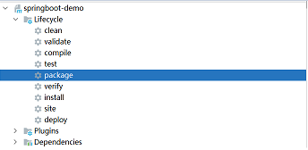 

> 打包之后，在target目录下生成jar文件。进入该目录，然后在命令行窗口执行：java -jar 包名
>
> 在linux上运行jar： 可以采用项目在后台运行 :  (默认在当前目录生成 nohup.out 运行日志)
>
> nohup javar -jar 包名 &    

## 2.mybatis-generator插件

### 2.1 pom.xml添加插件

~~~
<plugin>
     <groupId>org.mybatis.generator</groupId>
     <artifactId>mybatis-generator-maven-plugin</artifactId>
     <version>1.4.0</version> <!-- 不要低于 1.3.7 版本 -->
     <dependencies>
         <dependency>
             <groupId>mysql</groupId>
             <artifactId>mysql-connector-java</artifactId>
             <version>8.0.22</version>
         </dependency>
         <dependency>
             <groupId>org.mybatis.generator</groupId>
             <artifactId>mybatis-generator-core</artifactId>
             <version>1.4.0</version> <!-- 不要低于 1.3.7 版本 -->
         </dependency>
     </dependencies>
     <configuration>
         <verbose>true</verbose> <!-- 允许移动生成的文件 -->
         <overwrite>true</overwrite> <!-- 是否覆盖 -->
         <!--配置文件的路径 -->
         <configurationFile>src/main/resources/generatorConfig.xml</configurationFile>
     </configuration>
 </plugin>
~~~

### 2.2 generatorConfig.xml

~~~
<!DOCTYPE generatorConfiguration
        PUBLIC "-//mybatis.org//DTD MyBatis Generator Configuration 1.0//EN"
        "http://mybatis.org/dtd/mybatis-generator-config_1_0.dtd">
<generatorConfiguration>
    <context id="smbms"   targetRuntime="MyBatis3">
        <!-- 覆盖生成 XML 文件的 Bug 解决 -->
        <plugin type="org.mybatis.generator.plugins.UnmergeableXmlMappersPlugin" />
        <commentGenerator>
            <!--关闭时间注释 -->
            <property name="suppressDate" value="true"/>
            <!-- 是否去除自动生成的注释 true：是 ： false:否 -->
            <property name="suppressAllComments" value="true"/>
        </commentGenerator>
        <!--数据库链接URL，用户名、密码 -->
        <jdbcConnection driverClass="com.mysql.cj.jdbc.Driver"
                      connectionURL="jdbc:mysql://localhost:3306/smbms?useSSL=false&amp;serverTimezone=UTC"
                        userId="root" password="root">
        </jdbcConnection>
        <javaTypeResolver>
            <property name="forceBigDecimals" value="false"/>
        </javaTypeResolver>
        <!-- 生成po的包名和位置-->
        <javaModelGenerator targetPackage="com.woniu.entity" targetProject="src/main/java">
            <property name="enableSubPackages" value="true"/>
            <property name="trimStrings" value="true"/>
        </javaModelGenerator>
        <!-- 生成映射XML文件的包名和位置-->
        <sqlMapGenerator targetPackage="com.woniu.dao" targetProject="src/main/resources">
            <property name="enableSubPackages" value="true"/>
        </sqlMapGenerator>
        <!-- 生成dao文件包名和位置-->
        <javaClientGenerator type="XMLMAPPER" targetPackage="com.woniu.dao" targetProject="src/main/java">
            <property name="enableSubPackages" value="true"/>
        </javaClientGenerator>
        <!-- 要生成哪些表-->
        <table tableName="smbms_role" catalog="smbms"   domainObjectName="role"
               enableCountByExample="true"
               enableUpdateByExample="true"
               enableDeleteByExample="true"
               enableSelectByExample="true" selectByExampleQueryId="true">
            <property name="ignoreQualifiersAtRuntime" value="true"/>
           <generatedKey column="id" sqlStatement="Mysql" type="post" identity="true"/>
        </table>
    </context>
</generatorConfiguration>
~~~

### 2.3 生成相应文件

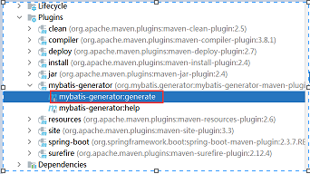 

### 2.4 测试

~~~
@Autowired  private RoleMapper roleMapper;
public List<Role> findRolesByCondition(String roleCode,String roleName){

    RoleExample example = new RoleExample();
    RoleExample.Criteria criteria = example.createCriteria();
    criteria.andRolecodeEqualTo(roleCode).andRolenameEqualTo(roleName);
    List<Role> roles = roleMapper.selectByExample(example);
    return roles;
}

public int  addTeacher(Teacher Teacher){
    int flag =  teacherMapper.insertSelective(Teacher);
    redisTeacherRepo.save(Teacher);
    return flag;
}

public int updateTeacher(Teacher Teacher){
    int flag =  teacherMapper.updateByPrimaryKeySelective(Teacher);
    //修改
    redisTeacherRepo.save(Teacher);
    return flag;
}
~~~


## 3.springboot脚手架

1、父工程构建

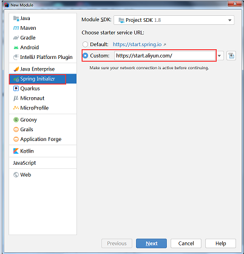 

父工程相关的依赖

~~~
<packaging>pom</packaging>
<properties>
    <java.version>1.8</java.version>
    <project.build.sourceEncoding>UTF-8</project.build.sourceEncoding>
    <project.reporting.outputEncoding>UTF-8</project.reporting.outputEncoding>
    <spring-boot.version>2.3.7.RELEASE</spring-boot.version>
</properties>

<dependencyManagement>
    <dependencies>
    <dependency>
        <groupId>org.springframework.boot</groupId>
        <artifactId>spring-boot-dependencies</artifactId>
        <version>${spring-boot.version}</version>
        <type>pom</type>
        <scope>import</scope>
        </dependency>
    </dependencies>
</dependencyManagement>
<build>
    <plugins>
        <plugin>
       		<!--maven编译时的插件-->
            <groupId>org.apache.maven.plugins</groupId>
            <artifactId>maven-compiler-plugin</artifactId>
            <version>3.8.1</version>
            <configuration>
            <source>1.8</source>
            <target>1.8</target>
            <encoding>UTF-8</encoding>
            </configuration>
        </plugin>
    </plugins>
</build>

~~~

子工程构建

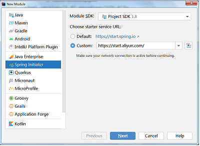 

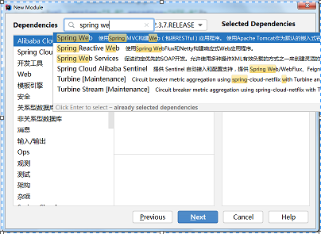 

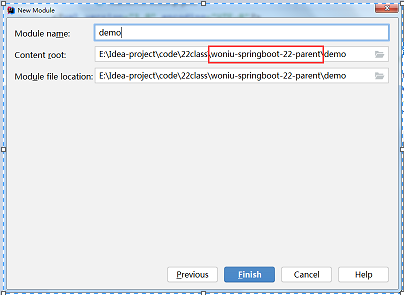 

子工程相关的pom依赖

~~~
<parent>
    <groupId>com.woniu.example</groupId>
    <artifactId>woniu-springboot-22-parent</artifactId>
    <version>woniu.1.0</version>
</parent>

<dependencies>
    <dependency>
        <groupId>org.springframework.boot</groupId>
        <artifactId>spring-boot-starter-web</artifactId>
    </dependency>
</dependencies>

<build>
    <plugins>
        <plugin>
            <groupId>org.mybatis.generator</groupId>
            <artifactId>mybatis-generator-maven-plugin</artifactId>
            <version>1.4.0</version> <!-- 不要低于 1.3.7 版本 -->
            <dependencies>
                <dependency>
                    <groupId>mysql</groupId>
                    <artifactId>mysql-connector-java</artifactId>
                    <version>8.0.22</version>
                </dependency>
                <dependency>
                    <groupId>org.mybatis.generator</groupId>
                    <artifactId>mybatis-generator-core</artifactId>
                    <version>1.4.0</version> <!-- 不要低于 1.3.7 版本 -->
                </dependency>
       	 	</dependencies>
        <configuration>
        <verbose>true</verbose> <!-- 允许移动生成的文件 -->
        <overwrite>true</overwrite> <!-- 是否覆盖 -->
        <!--配置文件的路径 -->
        <configurationFile>src/main/resources/generatorConfig.xml</configurationFile>
        </configuration>
        </plugin>
        <plugin>
            <groupId>org.springframework.boot</groupId>
            <artifactId>spring-boot-maven-plugin</artifactId>
            <version>2.3.7.RELEASE</version>
            <configuration>
            <mainClass>com.woniu.AppTest</mainClass>
            </configuration>
            <executions>
            <execution>
            <id>repackage</id>
            <goals>
            <goal>repackage</goal>
            </goals>
            </execution>
            </executions>
        </plugin>
    </plugins>
</build>
~~~

