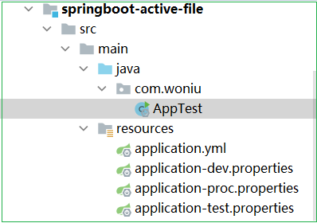
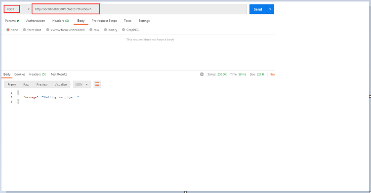

# springboot高级篇

## 1.springboot单元测试

### 1.1 引入启动器

~~~xml
<dependency>
    <groupId>org.springframework.boot</groupId>
    <artifactId>spring-boot-starter-test</artifactId>
</dependency>
~~~

> 不需要引入junit的jar包

### 1.2 测试方式1

在src/test/java目录下创建测试类，对dao接口方法测试

~~~java
import org.junit.jupiter.api.Test;   //注意junit包名

@SpringBootTest
class RoleMapperTest {
    @Autowired
    private RoleMapper roleMapper;
    @Test
    public void findRoles(){
        RoleExample example = new RoleExample();
        List<Role> roles = roleMapper.selectByExample(example);
        for(Role role : roles){
            System.out.println(role.getRolename());
        }
    }
}
~~~

### 1.3 测试方式2

~~~java
import org.junit.Test;
import org.junit.runner.RunWith;
import org.springframework.beans.factory.annotation.Autowired;
import org.springframework.boot.test.context.SpringBootTest;
import org.springframework.test.context.junit4.SpringJUnit4ClassRunner;

@RunWith(SpringJUnit4ClassRunner.class)
@SpringBootTest(classes = {UserApp.class})
public class aaa {

    @Autowired
    private UserDao userDao;
    
    @Test
    private void test1(){
    }
}
~~~


## 2.springboot异常处理

### 2.1 默认方式

SpringBoot 默认的处理异常的机制：SpringBoot 默认的已经提供了一套处理异常的机制。一旦程序中出现了异常 SpringBoot 向src/main/resources/templates目录下的/error 的 url 发送请求。在 springBoot 中提供了一个叫 BasicErrorController 来处理/error 请求，然后跳转到默认显示异常的页面来展示异常信息。

在src/main/resources/ templates创建error.html页面

~~~xml
<!DOCTYPE html>
<html xmlns:th="http://www.thymeleaf.org">
<head>
    <meta charset="UTF-8">
    <title>错误提示页面</title>
</head>
<body>
	出错了，请与管理员联系。。。
</body>
</html>
~~~

~~~java
@Controller
public class UserController {
    @RequestMapping("/show")
    public String showInfo() {
        String str = null;
        str.length();
        return "index";
    }
~~~

当我们在浏览器访问http://localhost/show时，会报异常，此时直接跳转到error.html页面

### 2.2 @ExceptionHandle 注解方式

在controller当前类中添加方法来捕获当前类抛出的异常，从而进行处理，该方法上添加@ExceptionHandler注解

~~~java
@Controller
public class UserController {
	@RequestMapping("/show2")
    public String showInfo2() {
        int a = 10 / 0;
        return "index";
    }
    @ExceptionHandler(value = {java.lang.ArithmeticException.class})
    public ModelAndView arithmeticExceptionHandler(Exception e) {
        ModelAndView mv = new ModelAndView();
        mv.addObject("error", e.toString());
        mv.setViewName("error1");  //逻辑视图名
        return mv;
    }
}
~~~

在resources/templates目录下创建error1.html页面

~~~html
<!DOCTYPE html>
<html xmlns:th="http://www.thymeleaf.org">
<head>
    <meta charset="UTF-8">
    <title>错误提示页面-ArithmeticException</title>
</head>
<body>
    出错了，请与管理员联系。。。
    <span th:text="${error}"></span>
</body>
</html>
~~~

### 2.3 @ControllerAdvice方式

自定义一个类GlobalException，并添加注解 @ControllerAdvice，或者@RestControllerAdvice， 在处理异常的方法上面添加@ExceptionHandler注解并在value中添加要处理的异常

~~~java
@ControllerAdvice
public class GlobalException {
    /**
     * java.lang.ArithmeticException
     * 该方法需要返回一个 ModelAndView：目的是可以让我们封装异常信息以及视
     * 图的指定
     * 参数 Exception e:会将产生异常对象注入到方法中
     */
    @ExceptionHandler(value = {ArithmeticException.class})
    public ModelAndView arithmeticExceptionHandler(Exception e) {
        ModelAndView mv = new ModelAndView();
        mv.addObject("error", e.toString());
        mv.setViewName("error1");
        return mv;
    }

    /**
     * java.lang.NullPointerException
     * 该方法需要返回一个 ModelAndView：目的是可以让我们封装异常信息以及视
     * 图的指定
     * 参数 Exception e:会将产生异常对象注入到方法中
     */
    @ExceptionHandler(value = {NullPointerException.class})
    public ModelAndView nullPointerExceptionHandler(Exception e) {
        ModelAndView mv = new ModelAndView();
        mv.addObject("error", e.toString());
        mv.setViewName("error2");
        return mv;
    }
}
~~~

### 2.4 注册全局异常解析器

自定义一个配置类，创建一个全局异常SimpleMappingExceptionResolver解析器的bean对象到spring容器中，有spring来管理

~~~java
@Configuration
public class GlobalException {
    /**
     * 该方法必须要有返回值。返回值类型必须是：
     * SimpleMappingExceptionResolver
     */
    @Bean
    public SimpleMappingExceptionResolver getSimpleMappingExceptionResolver() {
        SimpleMappingExceptionResolver resolver = new  SimpleMappingExceptionResolver();
        Properties mappings = new Properties();
        /**
         * 参数一：异常的类型，注意必须是异常类型的全名
         * 参数二：逻辑视图名称
         */
        mappings.put("java.lang.ArithmeticException", "error1");
        mappings.put("java.lang.NullPointerException", "error2");
        //设置异常与视图映射信息的
        resolver.setExceptionMappings(mappings);
        return resolver;
    }
}
~~~

## 3.SpringBoot定时任务

Scheduled  定时任务器：是 Spring3.0 以后自带的一个定时任务器

### 3.1 引入依赖

~~~xml
<dependency>
    <groupId>org.springframework.boot</groupId>
    <artifactId>spring-boot-starter-web</artifactId>
</dependency>
~~~

### 3.2 编写定时任务

~~~java
package com.woniu.schedule;

import org.springframework.scheduling.annotation.Scheduled;
import org.springframework.stereotype.Component;

import java.util.Date;

@Component
public class ScheduledDemo {
    /**
     *定时任务方法
     * @Scheduled:设置定时任务 cron 属性：cron 表达式。定时任务触发是时间的一个字符串表达形式
     */
    @Scheduled(cron = "0/2 * * * * ?")    
    //@Scheduled(initialDelay =  1000 * 10,fixedRate = 1000 * 5) //fixedRate = 1000 *5表示每5秒执行一次
    public void scheduledMethod() {
        System.out.println("定时器被触发" + new Date());
    }
}
~~~

### 3.3 开启定时任务注解

~~~java
import org.springframework.scheduling.annotation.EnableScheduling;

@SpringBootApplication
@EnableScheduling
public class UserApp {
    public static void main(String[] args) {
        SpringApplication.run(UserApp.class,args);
    }
}
~~~

### 3.4 Cron 表达式

~~~
Cron 表达式是一个字符串，分为 6 或 7 个域，每一个域代表一个含义；
Cron 从左到右（用空格隔开）： 秒   分   小时   月份中的日期   月份   星期中的日期    年份
~~~

Cron 有如下两种语法格式：
（1） Seconds Minutes Hours Day Month Week Year
（2）Seconds Minutes Hours Day Month Week

| 1             秒              0-59                   - * /   |
| ------------------------------------------------------------ |
| 2             分钟             0-59                - * /     |
| 3            小时              0-23                  - * /   |
| 4              日                1-31                 - * / L W C |
| 5              月                1-12                 - * /  |
| 6           星期               1-7                  - * ? / L C # |
| 7           年(可选)    1970-2099           - * /            |

Cron 表达式的时间字段除允许设置数值外，还可使用一些特殊的字符，提供列表、范围、通配符等功，如下：

> * 星号(**)：可用在所有字段中，表示对应时间域的每一个时刻，例如，*在分钟字段时，表示“每分钟”；
> * 问号（?）：该字符只在日期和星期字段中使用，它通常指定为“无意义的值”，相当于占位符；
> * 减号(-)：表达一个范围，如在小时字段中使用“10-12”，则表示从 10 到 12 点，即 10,11,12；
> * 逗号(,)：表达一个列表值，如在星期字段中使用“MON,WED,FRI”，则表示星期一，星期三和星期五；
> * 斜杠(/)：x/y 表达一个等步长序列，x 为起始值，y 为增量步长值。如在分钟字段中使用 0/15，则表示为 0,15,30 和 45 秒，而 5/15 在分钟字段中表示 5,20,35,50，你也可以使用*/y，它等同于 0/y；
> * L：该字符只在日期和星期字段中使用，代表“Last”的意思，但它在两个字段中意思不同。L 在日期字段中，表示这个月份的最后一天，如一月的 31 号，非闰年二月的 28 号；如果 L 用在星期中，则表示星期六，等同于 7。但是，如果 L 出现在星期字段里，而且在前面有一个数值 X，则表示“这个月的最后 X 天”，例如，6L 表示该月的最后星期五；
> * W：该字符只能出现在日期字段里，是对前导日期的修饰，表示离该日期最近的工作日。例如 15W表示离该月 15 号最近的工作日，如果该月 15 号是星期六，则匹配 14 号星期五；如果 15 日是星期日，则匹配 16 号星期一；如果 15 号是星期二，那结果就是 15 号星期二。但必须注意关联的匹配日期不能够跨月，如你指定 1W，如果 1 号是星期六，结果匹配的是 3 号星期一，而非上个月最后的那天。W 字符串只能指定单一日期，而不能指定日期范围；
> * LW 组合：在日期字段可以组合使用 LW，它的意思是当月的最后一个工作日；
> * 井号(#)：该字符只能在星期字段中使用，表示当月某个工作日。如 6#3 表示当月的第三个星期五(6表示星期五，#3 表示当前的第三个)，而 4#5 表示当月的第五个星期三，假设当月没有第五个星期三，忽略不触发；
> *  C：该字符只在日期和星期字段中使用，代表“Calendar”的意思。它的意思是计划所关联的日期，如果日期没有被关联，则相当于日历中所有日期。例如 5C 在日期字段中就相当于日历 5 日以后的第一天。1C 在星期字段中相当于星期日后的第一天。

案例说明：

~~~
@Scheduled(cron = "0 0 1 1 1 ?")//每年一月的一号的 1:00:00 执行一次
@Scheduled(cron = "0 0 1 1 1,6 ?") //一月和六月的一号的 1:00:00 执行一次
@Scheduled(cron = "0 0 1 1 1,4,7,10 ?") //每个季度的第一个月的一号的 1:00:00 执行一次
@Scheduled(cron = "0 0 1 1 * ?")//每月一号 1:00:00 执行一次
@Scheduled(cron="0 0 1 * * *") //每天凌晨 1 点执行一次
~~~


## 4.springboot热部署

## 5.springboot整合redis

### 5.1 添加redis启动器

```xml
 <dependency>
     <groupId>org.springframework.boot</groupId>
     <artifactId>spring-boot-starter-data-redis</artifactId>
 </dependency>
```

Spring Boot 提供了对 Redis 集成的组件包：**spring-boot-starter-data-redis**，它依赖于 **spring-data-redis** 和 **lettuce** 。

另外，这里还有两个小细节：

1. Spring Boot 1.x 时代，spring-data-redis 底层使用的是 **Jedis**；2.x 时代换成了 **Lettuce** 。
2. **Lettuce** 依赖于 **commons-pool2** 

### 5.2 Lettuce 的 timed out 问题

在 Spring Boot 2.x 默认使用 Lettuce 之后，会偶发性出现 `Redis command timed out` 问题，从而导致客户端（Java 代码）无法连接到 Redis Server 的问题。

而且该问题无法正面解决。网上通用的解决方案是：放弃使用 Lettuce 驱动，转而使用 Jedis 驱动。

这种情况下，你需要手动排除 spring-data-redis 对 Lettuce 的依赖，并引入 Jedis 依赖。

```xml
<dependency>
  <groupId>org.springframework.boot</groupId>
  <artifactId>spring-boot-starter-data-redis</artifactId>
  
  <exclusions> <!-- 从依赖关系中排除 -->
    <exclusion>
      <groupId>io.lettuce</groupId>
      <artifactId>lettuce-core</artifactId>
    </exclusion>
  </exclusions>
</dependency>
<dependency>
  <groupId>redis.clients</groupId>
  <artifactId>jedis</artifactId>
</dependency>
```

如果springboot的版本是2.3.7 中这个问题不存在了

### 5.3 快速上手

1、引入依赖

~~~xml
<dependency>
  <groupId>org.springframework.boot</groupId>
  <artifactId>spring-boot-starter-data-redis</artifactId>
</dependency>
~~~

2、application 配置

~~~yml
## Redis 服务器地址
spring.redis.host=localhost
## Redis 服务器连接端口
spring.redis.port=6379
## Redis 数据库索引（默认为 0）
spring.redis.database=0
## Redis 服务器连接密码（默认为空）
spring.redis.password=
## 以下非必须，有默认值
## 连接池最大连接数（使用负值表示没有限制）默认 8
spring.redis.lettuce.pool.max-active=8
## 连接池最大阻塞等待时间（使用负值表示没有限制）默认 -1
spring.redis.lettuce.pool.max-wait=-1
## 连接池中的最大空闲连接 默认 8
spring.redis.lettuce.pool.max-idle=8
## 连接池中的最小空闲连接 默认 0
spring.redis.lettuce.pool.min-idle=0
~~~

> 如果连接远程服务器，那么把redis服务器的配置文件的 bind 绑定服务器ip，或者是写成 bind 0.0.0.0

3、测试使用

在单元测试中，注入 **RedisTemplate<Object, Object>** 或 **StringRedisTemplate** 。

> 这两个 bean 被声明在了 *...RedisAutoConfiguration* 中。在你没有自己配置 RedisTemplate 的 Bean 的情况下，spring-data-redis 使用的就是它们俩（中的一个）。
>
> 另外，**StringRedisTemplate** 是 RedisTemplate 的子类，它等同于 RedisTemplate<String, String> 。
>
> StringRedisTemplate 比 RedisTemplate<Object, Object> 更简单、常见。RedisTemplate<Object, Object> 会涉及一个转换器（Serializer）的概念。优先考虑使用 StringRedisTemplate 。

~~~java
@SpringBootTest
public class TestRedisTemplate {
    @Autowired
    private StringRedisTemplate redisTemplate;
    @Test
    public void testString() {
        redisTemplate.opsForValue().set("hello", "world");
        Assert.assertEquals("world", redisTemplate.opsForValue().get("hello"));
    }
}
~~~

在这个单元测试中，我们使用 redisTemplate 存储了一个字符串 `"world"` ，存储之后获取进行验证，多次进行 set 相同的 key，键对应的值会被覆盖。

Spring Data Redis 针对 api 进行了重新归类与封装，将同一类型的操作封装为 **Operation** 接口：

| 专有操作        | 说明                  |
| :-------------- | :-------------------- |
| ValueOperations | string 类型的数据操作 |
| ListOperations  | list 类型的数据操作   |
| SetOperations   | set 类型数据操作      |
| ZSetOperations  | zset 类型数据操作     |
| HashOperations  | map 类型的数据操作    |

~~~java
@Autowired
private StringRedisTemplate redisTemplate;

@Test
public void contextLoad() {
    assertNotNull(redisTemplate);
    ValueOperations<String, String> stringOperations = redisTemplate.opsForValue();
    HashOperations<String, String, String> hashOperations = redisTemplate.opsForHash();
    ListOperations<String, String> listOperations  = redisTemplate.opsForList();
    SetOperations<String, String> setOperations = redisTemplate.opsForSet();
    ZSetOperations<String, String> zsetOperations = redisTemplate.opsForZSet();
}
~~~

### 5.4 RedisTemplate 和 Serializer（了解）

**RedisTemplate<Object, Object>** 看起来比 StringRedisTemplate 更『牛逼』一些，因为它不强求键和值的类型必须是 String 。

但是很显然，这和 Redis 的实际情况是相违背的：在最小的存储单元层面，Redis 本质上只能存字符串，不可能存其它的类型。这么看来，StringRedisTemplate 更贴合 Redis 的存储本质。那么 RedisTemplate 是如何实现以任何类型（只要是实现了 Serializable 接口）作为键值对的？**通过 Serializer** 。

RedisTemplate 会将你交给它的作为键或值的任意类型对象（唯一要求是实现了 Serializable 接口）使用 Serializer 进行转换，转换成字符串，然后再存入 Redis 中。这样就没有违背『Redis 的最小存储单元中只能存字符串』的准则。

RedisTemplate 默认使用的是 **JdkSerializationRedisSerializer** 进行 Object 到 String 的双向转换工作。它将对象转换为字节数组的字符串形式。

> 对象的字节数组的字符串形式如下。看起来怪怪的感觉。
>
> 127.0.0.1:6379> get "\xac\xed\x00\x05t\x00\x0cdepartment:1" "\xac\xed\x00\x05sr\x00"com.woniu.example1.bean.Department\x00\x00\x00\x00\x00\x00\x00\x01\x02\x00\x03L\x00\x02idt\x00\x13Ljava/lang/Integer;L\x00\blocationt\x00\x12Ljava/lang/String;L\x00\x04nameq\x00~\x00\x02xpsr\x00\x11java.lang.Integer\x12\xe2\xa0\xa4\xf7\x81\x878\x02\x00\x01I\x00\x05valuexr\x00\x10java.lang.Number\x86\xac\x95\x1d\x0b\x94\xe0\x8b\x02\x00\x00xp\x00\x00\x00\x01t\x00\x05Wuhant\x00\aTesting"

考虑到『对象的字节数组的字符串形式』不便于阅读，因此，你可以考虑将默认的 JdkSerializationRedisSerializer 替换掉。这种情况下，你就需要自己去声明 RedisTemplate（@Bean）

记得要加 jackson 的依赖：

```xml
<dependency>
  <groupId>com.fasterxml.jackson.core</groupId>
  <artifactId>jackson-databind</artifactId>
</dependency>
```

```java
@Configuration
public class RedisConfig {
    @Bean(name = "redisTemplate")
    public RedisTemplate<String, Object> redisTemplate(RedisConnectionFactory redisConnectionFactory)
            throws UnknownHostException {
        RedisTemplate<String, Object> template = new RedisTemplate<>();
        template.setConnectionFactory(redisConnectionFactory);
        template.setKeySerializer(RedisSerializer.string());
        template.setValueSerializer(RedisSerializer.json());
        return template;
    }
}
```

### 5.5 各类型实践

#### 1 String字符串

```java
@Slf4j
@Test
public void testObj() {
    ValueOperations<String, String> operations = redisTemplate.opsForValue();
    operations.set("id", "9527");
    operations.set("name", "tom");
    operations.set("age", "21");
    String name = operations.get("name");
    log.info("{}", name);
}
```

key的自动过期问题，Redis 在存入每一个数据的时候都可以设置一个超时间，过了这个时间就会自动删除数据。

新建一个 Student 对象，存入 Redis 的同时设置 100 毫秒后失效，设置一个线程暂停 1000 毫秒之后，判断数据是否存在并打印结果。

```java
@Test
public void testExpire() throws InterruptedException {
    final String key = "expire" ;
    Student user = new Student("tom", 20);
    ValueOperations<String, Student> operations = redisTemplate.opsForValue(); 
    operations.set(key, user, 100, TimeUnit.MILLISECONDS);  // 这背后就有 Serializer 在工作

    Thread.sleep(1000);

    boolean exists = redisTemplate.hasKey(key);
    System.out.println( exists ? "exists is true" : "exists is false" );
}
```

从结果可以看出，Reids 中已经不存在 Student 对象了，此数据已经过期，同时我们在这个测试的方法中使用了 *`hasKey("expire")`* 方法，可以判断 key 是否存在

3、删除数据

有些时候，我们需要对过期的缓存进行删除，下面来测试此场景的使用。首先 set 一个字符串 `hello world`，紧接着删除此 key 的值，再进行判断。

~~~
redisTemplate.delete("key");
~~~

#### 2 Hash（哈希）

一般我们存储一个键，很自然的就会使用 get/set 去存储，实际上这并不是很好的做法。Redis 存储一个 key 会有一个最小内存，不管你存的这个键多小，都不会低于这个内存，因此合理的使用 Hash 可以帮我们节省很多内存。

Hash Set 就在哈希表 Key 中的域（Field）的值设为 value。如果 Key 不存在，一个新的哈希表被创建并进行 HSET 操作;如果域（field）已经存在于哈希表中，旧值将被覆盖。

先来看 Redis 对 Pojo 的支持，新建一个 Student 对象（需要实现 Serializable 接口），放到缓存中，再取出来。

```java
@Test
public void testHash() {
    final String key = "tom"; 

    HashOperations<String, Object, Object> hash = redisTemplate.opsForHash();
    hash.put(key, "name", "tom");
    hash.put(key, "age", "20");

    String value = hash.get(key, "name");
    log.info("hash value : {}", value);
}
```

输出结果:

```text
hash value :tom
```

根据上面测试用例发现，Hash set 的时候需要传入三个参数，第一个为 key，第二个为 field，第三个为存储的值。一般情况下 Key 代表一组数据，field 为 key 相关的属性，而 value 就是属性对应的值。

#### 3 List集合类型

Redis List 的应用场景非常多，也是 Redis 最重要的数据结构之一。 使用 List 可以轻松的实现一个队列， List 典型的应用场景就是消息队列，可以利用 List 的 Push 操作，将任务存在 List 中，然后工作线程再用 POP 操作将任务取出进行执行。

```java
@Test
public void testList() {
    final String key = "list";
    ListOperations<String， String> list = redisTemplate.opsForList();
    list.leftPush(key, "hello");
    list.leftPush(key, "world");
    list.leftPush(key, "goodbye");
    String value = list.leftPop(key);

    log.info("list value : {}", value.toString());
}
```

输出结果

```text
list value :goodbye
```

上面的例子我们从左侧插入一个 key 为 "list" 的队列，然后取出左侧最近的一条数据。其实 List 有很多 API 可以操作，比如从右侧进行插入队列，从右侧进行读取，或者通过方法 range 读取队列的一部分。接着上面的例子我们使用 range 来读取。

```java
List<String> values = list.range(key, 0, 2);
for (String v : values) {
    System.out.println("list range :" + v);
}
```

输出结果:

```text
list range :goodbye
list range :world
list range :hello
```

range 后面的两个参数就是插入数据的位置，输入不同的参数就可以取出队列中对应的数据。

Redis List 的实现为一个双向链表，即可以支持反向查找和遍历，更方便操作，不过带来了部分额外的内存开销，Redis 内部的很多实现，包括发送缓冲队列等也都是用的这个数据结构。

#### 4 Set集合类型

Redis Set 对外提供的功能与 List 类似，是一个列表的功能，特殊之处在于 Set 是可以自动排重的，当你需要存储一个列表数据，又不希望出现重复数据时，Set 是一个很好的选择，并且 Set 提供了判断某个成员是否在一个 Set 集合内的重要接口，这个也是 List 所不能提供的。

```java
@Test
public void testSet() {
    final String key = "set";
    SetOperations<String, String> set = redisTemplate.opsForSet();
    set.add(key, "hello");
    set.add(key, "world");
    set.add(key, "world");
    set.add(key, "goodbye");
    Set<String> values = set.members(key);
    for (String v : values) {
        System.out.println("set value :" + v);
    }
}
```

输出结果:

```text
set value :hello
set value :world
set value :goodbye
```

通过上面的例子我们发现，输入了两个相同的值 `world`，全部读取的时候只剩下了一条，说明 Set 对队列进行了自动的排重操作。另外，Redis 为集合提供了求交集、并集、差集等操作，可以非常方便的使用，这里就不一一举例了。

#### 5 ZSet集合类型

Redis Sorted Set 的使用场景与 Set 类似，区别是 Set 不是自动有序的，而 Sorted Set 可以通过用户额外提供一个优先级（Score）的参数来为成员排序，并且是插入有序，即自动排序。

在使用 Zset 的时候需要额外的输入一个参数 Score，Zset 会自动根据 Score 的值对集合进行排序，我们可以利用这个特性来做具有权重的队列，比如普通消息的 Score 为 1，重要消息的 Score 为 2，然后工作线程可以选择按 Score 的倒序来获取工作任务。

```java
@Test
public void testZset() {
    final String key = "zset";
    redisTemplate.delete(key);
    ZSetOperations<String, String> zset = redisTemplate.opsForZSet();
    zset.add(key, "hello", 1);
    zset.add(key, "world", 6);
    zset.add(key, "good", 4);
    zset.add(key, "bye", 3);

    Set<String> zsets = zset.range(key, 0, 3);
    for (String v : zsets) {
        log.info("zset-A value : {}", v);
    }

    Set<String> zsetB = zset.rangeByScore(key, 0, 3);
    for (String v : zsetB) {
        log.info("zset-B value : {}", v);
    }   
}
```

输出结果:

```text
zset-A value : hello
zset-A value : bye
zset-A value : good
zset-A value : world
zset-B value : hello
zset-B value : bye
```

## 6.springboot整合redis实战

### 6.1 RedisTemplate方式

```java
package com.woniu.service.impl;
import com.fasterxml.jackson.core.type.TypeReference;
import com.fasterxml.jackson.databind.ObjectMapper;
import org.springframework.data.redis.core.BoundValueOperations;
import org.springframework.data.redis.core.RedisTemplate;

@Service
public class UserServiceImpl implements UserService {
    @Autowired
    private RedisTemplate<String,String> redisTemplate;
    //@Autowired
    //private StringRedisTemplate redisTemplate;

    @Autowired
    private UserMapper userMapper;

    @Transactional
    public void deleteById(Long id){
    	//增删改操作 redis的缓存要删除，保证和数据库数据一致性
        this.userMapper.deleteByPrimaryKey(id);
    }
    @Override
    public List<User> findUsers() {
        BoundValueOperations<String, String> stringTemplate  = redisTemplate.boundValueOps("userlist");
        Object str = stringTemplate.get();
        List<User> users = new ArrayList<User>();
        ObjectMapper om = new ObjectMapper();
        try {
            if(str == null){
                users = this.userMapper.selectAll();
                //集合转成字符串
                str = om.writeValueAsString(users);
                redisTemplate.boundValueOps("userlist").set(str.toString());
            }else{
                System.out.println("===============从redis缓存中获得数据===============");
                users = om.readValue(str.toString(),new TypeReference<List<User>>(){});
            }
        }catch(Exception ex){
            ex.printStackTrace();
        }
        return users;
    }
}
```

> 说明1：RedisTemplate<String,String> 不建议写成RedisTemplate<Object，Object>形式，否则key序列化成很难看的样子
>
> 说明2：连接不上redis，注意防火墙是否关，其次是redis配置文件中的bind 绑定的服务器ip是多少。或者bind 0.0.0.0，或者都注释掉

> 说明3：为了缓存一致性，对增删改操作，都需要删除redis的key

### 6.2 Redis Repositories方式

Spring Data Redis 从 1.7 开始提供 Redis Repositories ，可以无缝的转换并存储 domain objects，使用的数据类型为哈希（hash）。

Spring Data Redis 的 Repository 的基本实现为：**CrudRepository** 。

基础用法（Usage）分为以下三步：

#### 1.启用 Repository 功能

编写一个配置类（或直接利用 Spring Boot 的入口类），在其上标注 ***`@EnableRedisRepositories(basePackages = "...")`***，表示启用 Repository 功能。

```
@SpringBootApplication
@MapperScan(value = "com.woniu.outlet.dao")
@EnableRedisRepositories(basePackages = "com.woniu.outlet.redis")
public class K15ManagerApplication {
    public static void main(String[] args) {
        SpringApplication.run(K15ManagerApplication.class, args);
    }
}
```

属性 ***`basePackages`*** 如果不赋值，那么默认是扫描入口类平级及之下的所有类，看它们谁的头上有 ***`@Repository`*** 注解。如果是同时使用 spring-data-jpa 和 spring-data-redis 时，由于它们的 Repository 的祖先中都有 CrudRepository 因此会造成冲突。虽有，最好还是加上 ***`basePackages`*** 属性并为它赋值，指定各自扫描的路径，以避免冲突

####  2.注解需要缓存的实体

添加关键的两个注解 ***`@RedisHash`*** 和 ***`@Id`*** ;

```java
@RedisHash("user")
@Data
public class User implements Serializable {
    private static final long serialVersionUID = 1L;
    @Id
    private Long id;
    private String userName;
    private String password;
    private String email;
    //当然我们也可以定义集合
    List<XX> lists;
}
```

| 注解       | 说明                                                       |
| :--------- | :--------------------------------------------------------- |
| @RedisHash | 表示将 User 类的对象都对于 Redis 中的名为 user 的 Set 中。 |
| @Id        | 标注于对象的唯一性标识上。                                 |

如果将多个 User 对象通过 Repository 存储于 Redis 中，那么，它们每个的 key 分别是：***`user:<Id>`** 。例如：`user:1`、`user:2`、`user:3`、...

获取它们每个对象的属性的命令为：

~~~
hget user:1 userName
hget user:1 lists.[0].属性
~~~

#### 3.创建Repository 接口

自定的 Repository 接口必须继承 CrudRepository，才能“天生”具有存取数据的能力。

~~~
public interface RedisUserRepo extends CrudRepository<User,Integer> {
}
~~~

#### 4.测试

```java
@SpringBootTest
public class RedisTest {
    @Resource  //默认按名字安装，去容器池找stringRedisTemplate这个对象名
    private StringRedisTemplate stringRedisTemplate;
    //@Resource
    //private StringRedisTemplate redisTemplate;//报错
    @Autowired
    private StringRedisTemplate redisTemplate;//可以
    @Autowired
    private TeacherMapper teacherMapper;

    @Autowired
    private RedisTeacherRepo redisTeacherRepo;

    @Test
    public void testredis() {
        List<Teacher> teachers = teacherMapper.selectByExample(null);
        redisTeacherRepo.saveAll(teachers);

        Iterable<Teacher> alls = redisTeacherRepo.findAll();
        alls.forEach(item -> System.out.println(item.getName()));
    }
}
```

### 6.3 附录（了解）

有的时候我们需要手动创建JedisConnectionFactory、JedisPoolConfig 、RedisTemplate来覆盖springboot默认帮我们创建的这些对象，那么除了引入spring-boot-starter-data-redis之外，你还需要引入jedis包

~~~xml
<dependency>
    <groupId>redis.clients</groupId>
    <artifactId>jedis</artifactId>
</dependency>
~~~

添加redis的配置

~~~yaml
spring.redis.pool.max-idle=10
spring.redis.pool.min-idle=5
spring.redis.pool.max-total=20
spring.redis.hostName=192.168.5.141
spring.redis.password=admin
spring.redis.port=6379
~~~

编写配置类

~~~java
@Configuration
public class RedisConfig {
    /**
    * 1.创建 JedisPoolConfig 对象。在该对象中完成一些链接池配置
    **/
    @Bean
    @ConfigurationProperties(prefix="spring.redis.pool")
    public JedisPoolConfig jedisPoolConfig() {
    	JedisPoolConfig config = new JedisPoolConfig();
    	return config;
    }
    /**
     * 2.创建 JedisConnectionFactory：配置 redis 链接信息
     */
    @Bean
    @ConfigurationProperties(prefix="spring.redis")
    public JedisConnectionFactory jedisConnectionFactory(JedisPoolConfig config) {
        JedisConnectionFactory jedisConnectionFactory = new JedisConnectionFactory();
        return jedisConnectionFactory;
    }
    @Bean
    public RedisTemplate<String, Object> redisTemplate(JedisConnectionFactory jedisConnectionFactory) {
        RedisTemplate<String, Object> template = new RedisTemplate<>();
        //关联
        template.setConnectionFactory(jedisConnectionFactory);
        //为 key 设置序列化器
        template.setKeySerializer(new StringRedisSerializer());
        //为 value 设置序列化器
        template.setValueSerializer(new StringRedisSerializer());
        return template;
    }
}
~~~


## 7.springboot整合redis集群(扩展)

### 7.1 修改application.yml

```yml
spring:
  application:
    name: springboot-demo
  redis:
    cluster:
      nodes: 192.168.128.128:7001,192.168.128.128:7002,192.168.128.128:7003,192.168.128.128:7004,....
```

添加jar依赖

```xml
<dependency>
    <groupId>org.springframework.boot</groupId>
    <artifactId>spring-boot-starter-data-redis</artifactId>
</dependency>
```

测试：

~~~java
@Autowired
private StringRedisTemplate redisTemplate;
@Test
void contextLoads() {
    BoundValueOperations<String, String> ops = redisTemplate.boundValueOps("hello");
    ops.set("nihaoma");
}
~~~

### 7.3 业务类

```java
@Service
@Transactional
public class UserServiceImpl implements UserService {
    @Autowired
    private UserMapper usermapper;
    @Autowired
    private StringRedisTemplate redistemplate;
    public List<User> findAllUsers() {
        List<User> findAllUsers = new ArrayList<User>();
        String str = redistemplate..boundValueOps("userlist").get();
        ObjectMapper om = new ObjectMapper();
        try {
            if (str == null) {
                findAllUsers = this.userMapper.selectAll();
                str = om.writeValueAsString(findAllUsers);
                redistemplate.set("userlist", str);
            }
            else {
                System.out.println("===============从redis缓存中获得数据===============");
                findAllUsers = om.readValue(str.toString(), new TypeReference<List<User>>() {
                });
            }
        } catch (Exception e) {
            e.printStackTrace();
        }
        return findAllUsers;
    }
}
```

### 7.4 测试

登录集群客户端查看存储信息

~~~
./redis-cli -c -h 192.168.128.128 -p 7001 --raw   
~~~

说明：--raw 参数的作用：

* 按数据原有格式打印数据，不展示额外的类型信息
* 显示中文  （有时候我们需要向redis中写入含有中文的数据，然后在查看数据，但是会看到一些utf-8编码的字符，而不是我们写入的中文）


## 8.springboot多文件配置(了解)

### 8.1spring.profiles.active 配置

默认情况下，当你启动 SpringBoot 项目时，会在日志中看到如下一条 INFO 信息：

```
No active profile set, falling back to default profiles: default
```

这条消息是在告诉你，由于你没有激活、启用某个配置文件，SpringBoot 使用了默认的配置文件，也就是 application.properties 或 application.yml 

> 当然，这并不是什么错误。

SpringBoot 允许我们的项目提供多配置文件，并『激活、启用』其中的某一个。这些配置文件的命名规则为：application-xxx.properties或 application-xxx.yml

提供多个配置文件之后，你在 SpringBoot 默认加载的配置文件 **application.properties** 或 **application.yml** 中只用写一个配置项，用以激活、启用某个 *.properties* 或 *.yml* 即可。例如：

```yaml
spring:
  profiles:
    active: dev
```

上例中的 dev就是 application-xxx.properties 或 application-xx.yml中的那个 xxx 。

现在你再启动 SpringBoot，你会看到如下的 INFO 信息：

```
The following profiles are active: dev
```

这表示 SpringBoot 本次启动使用的就是这个配置文件。

另外，有一种『**简写**』：可以将 application.yml 和各个 application-xxx.yml 凑在一起，就写在 application.yml 配置文件中：

 


```yaml
spring:
  profiles:
    active: dev

---
spring:
  profiles: dev
...

---
spring:
  profiles: test
...

---
spring:
  profiles: proc
...
```

### 8.2 @Profile 和 @ActiveProfiles 注解

**@Profile** 注解配合 `spring.profiles.active` 参数，也可以实现不同环境下（开发、测试、生产）配置参数的切换。

~~~java
@Configuration
public class ProFileConfig {
    @Profile("dev")
    @Bean
    public User tommy() {
        return new User("tom", 20);
    }

    @Bean
    @Profile("test")
    public User jerry() {
        return new User("jep", 19);
    }
}
~~~

在上面的配置中：

- 存在 2 套配置：dev和 test；
- name 为 tom 的 Use rBean 仅存在于 dev的配置套餐中；
- name 为 jep 的 User Bean 仅存在于 test 的配置套餐中；

在 application.yml 配置文件通过 active 配置激活启动一个：

~~~java
spring:
  profiles:
    active: dev
~~~

测试：

~~~java
@RestController
public class UserController {
    @Autowired
    private User user;

    @RequestMapping("/hello")
    public Object hello(){
        return user;     //结果   "tom", 20
    }
}
~~~

另外，**@ActiveProfiles** 注解（只能在测试环境中）可以起到spring.profiles.active 参数的作用。这个注解在spring-boot-starter-test启动器里面。在测试类的使用中，你也可以将 application.yml 中的 active 配置项去掉，转而在测试类的头上使用 **@ActiveProfiles** 注解，也能起到同样效果：

```java
@SpringBootTest
@ActiveProfiles(profiles = "dev")
class AppTest {
    @Autowired
    private User user;
    ...
}
```


## 9.SpringBootActuator 监控

Spring Boot 是⼀个自带监控的开源框架，组件 Spring Boot Actuator 负责监控应用的各项静态和动态的变量。在项目中结合 Spring Boot Actuator 的使用，便可轻松对 Spring Boot 应用监控治理。

### 9.1 Actuator 监控

只需要在项目中添加 **spring-boot-starter-actuator**，就自动启用了监控功能。

```xml
<dependencies>
  <dependency>
    <groupId>org.springframework.boot</groupId>
    <artifactId>spring-boot-starter-web</artifactId>
  </dependency>
  <dependency>
    <groupId>org.springframework.boot</groupId>
    <artifactId>spring-boot-starter-actuator</artifactId>
  </dependency>
</dependencies>
```

Spring Boot Actuator 是 Spring Boot 提供的对应用系统的检查和监控的集成功能，可以查看应用配置的详细信息，例如自动化配置信息、创建的 Spring beans 以及⼀些环境属性等。

Actuator 监控分成两类：原生端点和用户自定义端点。自定义端点主要是指扩展性，用户可以根据自己的实际应用，定义⼀些比较关心的指标，在运行期进行监控。

### 9.2 Actuator 的 REST 接口

原生端点是在应用程序里提供众多 Web 接口，通过它们了解应用程序运行时的内部状况，原生端点又可以分成三类：

- **应用配置类**：可以查看应用在运行期的静态信息，例如自动配置信息、加载的 springbean 信息、yml 文件配置信息、环境信息、请求映射信息；
- **度量指标类**：主要是运行期的动态信息，如堆栈、请求连、⼀些健康指标、metrics 信息等；
- **操作控制类**：主要是指 shutdown，用户可以发送⼀个请求将应用的监控功能关闭。

Actuator 提供了十多个接口。

### 9.3 常见命令详解

在 Spring Boot 2.x 中为了安全期间，Actuator 只开放了两个端点 **/actuator/health** 和 **/actuator/info**，可以在配置文件中设置打开其它。

可以打开所有的监控点：

```properties
management.endpoints.web.exposure.include=*
```

Actuator 默认所有的监控点路径都在 **/actuator/\***，当然如果你对 **actuator** 这个名字不满意，你也可以自定义：

```properties
management.endpoints.web.base-path=/manage
```

设置完重启后，再次访问地址就会变成 **/manage/\*** ，不再是以前的 */actuator/**。当然一般情况下不会动这个配置。

Actuator 几乎监控了应用涉及的方方面面，我们重点讲述⼀些经常在项目中常用的命令。

### health

health 主要用来检查应用的运行状态，这是我们使用最高频的⼀个监控点，通常使用此接口提醒我们应用实例的运行状态，以及应用不“健康”的原因，如数据库连接、磁盘空间不够等。

默认情况下 **/actuator/health** 的状态是开放的，添加依赖后启动项目，访问：[http://127.0.0.1:8080/actuator/health 即可看到应用的状态。

```json
{
    "status" : "UP"
}
```

默认情况下只是展示简单的 **UP** 和 **DOWN** 状态，为了查询更详细的监控指标信息，可以在配置文件中添加以下信息：

```text
management.endpoint.health.show-details=always
```

重启后再次访问网址 [http://localhost:8080/actuator/health，返回信息如下：

```json
{
  "status": "UP",
  "diskSpace": {
    "status": "UP",
    "total": 209715195904,
    "free": 183253909504,
    "threshold": 10485760
  }
}
```

可以看到 HealthEndPoint 给我们提供默认的监控结果，包含磁盘空间描述总磁盘空间，剩余的磁盘空间和最小阈值。

### info

info 是我们自己在配置文件中以 info 开头的配置信息，比如在示例项目中的配置是：

```properties
info.app.name=spring-boot-actuator
info.app.version=1.0.0
info.app.test=test
```

启动示例项目，访问 [http://localhost:8080/actuator/info返回部分信息如下：

```json
info
{
    "app": {
        "name": "spring-boot-actuator",
        "version": "1.0.0",
        "test":"test"
    }
}
```

### env

展示了系统环境变量的配置信息，包括使用的环境变量、JVM 属性、命令行参数、项目使用的 jar 包等信息。

启动示例项目，访问网址 [http://localhost:8080/actuator/env返回部分信息如下：

```json
{
  "profiles": [

  ],
  "server.ports": {
    "local.management.port": 8088,
    "local.server.port": 8080
  },
  "servletContextInitParams": {

  },
  "systemProperties": {
    ...
  }
```

为了避免敏感信息暴露到 **/actuator/env** 里，默认所有名为 password、secret、key（或者名字中最后⼀段是这些）的属性在 **/actuator/env** 里都会加上 ***** 。

举个例⼦，如果有⼀个属性名字是 **database.password**，那么它在 **/actuator/env** 中的显示效果是这样的：

```json
"database.password": "****"
```

### /env/{name} 用法

就是 env 的扩展可以获取指定配置信息，比如 http://localhost:8080/actuator/env/java.vm.version，返回 `、{"java.vm.version":"25.151-b12"}。

### shutdown

开启shutdown接口，用来优雅关闭 Spring Boot 应用，要使用这个功能首先需要在配置文件中开启：

```text
management.endpoint.shutdown.enabled=true
```

配置完成之后，启动示例项目 

**shutdown 接口默认只支持 post 请求** 。http://localhost:8080/actuator/shutdown

 

此时会发现应用已经被关闭。

### mappings

描述全部的 URI 路径，以及它们和控制器的映射关系。

启动示例项目，访问网址 http://localhost:8080/actuator/mappings返回部分信息如下：

```json
{
  "/**/favicon.ico": {
    "bean": "faviconHandlerMapping"
  },
  "{[/hello]}": {
    "bean": "requestMappingHandlerMapping",
    "method": "public java.lang.String com.neo.controller.HelloController.index()"
  },
  "{[/error]}": {
    "bean": "requestMappingHandlerMapping",
    "method": "public org.springframework.http.ResponseEntity<java.util.Map<java.lang.String, java.lang.Object>> org.springframework.boot.autoconfigure.web.BasicErrorController.error(javax.servlet.http.HttpServletRequest)"
  }
}
```

## 10.Java命令行启动jar包

1、默认如果jar包没有启动文件，可以采用这种方式进行启动，当然这样方式也可以去修改配置的端口

~~~shell
java -jar xxx.jar --server.port=端口
~~~

2、jar包里有application-dev.properties或application-dev.yml，application-test.properties或application-test.yml，application-proc.properties或application-proc.yml这类资源文件，启动时可以指定加载哪个文件；而且使用 "`--spring.profiles.active`" 参数,搭配@Profile注解,可以实现不同环境下（开发、测试、生产）配置参数的切换

~~~shell
java -jar xxx.jar --spring.profiles.active=dev
~~~

3、指定加载某个资源文件

SpringBoot读取配置文件的优先级为：

* 项目jar包同级下的config文件夹是优先级最高的
  * 例如：打好的jar包放在D盘下，那么在D盘创建一个config文件夹，把application.yml或者application.properties放到config目录里，这个时候执行 java -jar xx.jar 时，会自动加载config目录里面的application.yml或者application.properties
* 项目jar包同级下直接放application.properties或者application.yml文件是次优先级，是直接把配置文件放到jar包的同级目录
* 项目内部的classpath同级config文件夹是第三优先级，在classpath下建一个config文件夹，然后把配置文件application.properties或者application.yml放进去
* 项目内部的classpath同级放properties文件是最低优先级，是在classpath下直接放配置文件

当然除了默认的这些application.properties或者是application.yml文件之外，我们也可以在项目的classpath里面创建其它的配置文件，例如：我们可以在根目录下（resources）创建一个名字为xxx.yml；也可以在根目录下（resources）创建一个yyy目录，在yyy目录里面创建xxx.yml文件；甚至你直接把某个配置文件放在某个盘符下

~~~shell
java -jar aa.jar --spring.config.location=classpath:/xxx.yml 或者 application.properties
java -jar aa.jar --spring.config.location=classpath:/yyy/xxx.yml
java -jar aa.jar --spring.config.location=xxx.yml      ##和jar同目录
java -jar aa.jar --spring.config.location=e:\\xxx.yml  ##放在e盘
java -jar -Dspring.config.location=D:\config\config.properties

##添加虚拟机参数
nohup java -jar -Xms512m -Xmx2048m -XX:PermSize=64m -XX:MaxPermSize=128m xx.jar &
~~~


## 11.springboot整合mail

1.引入依赖

~~~xml
<dependency>
    <groupId>org.springframework.boot</groupId>
    <artifactId>spring-boot-starter-mail</artifactId>
</dependency>
~~~


2.编写相关配置

~~~yml
spring:
  application:
    name: springboot-demo
  mail:
    host: smtp.qq.com    #服务器
    username: 897031817@qq.com  #你的邮箱地址
    password: fhyawuhgfoehbfcg  #邮箱授权码是刚才开启POP3/SMTP服务时生成的链接字符
    port: 25                    #端口号
    protocol: smtp             #SMTP 可以理解为协议
~~~

3.测试

~~~java
@Autowired
private JavaMailSenderImpl javaMailSender;
@Test
void contextLoads() {

    SimpleMailMessage message = new SimpleMailMessage();
    message.setSubject("email测试");
    message.setText("邮件测试内容,验证码：7788");
    message.setTo("897031817@qq.com");    //收件人的邮箱
    message.setFrom("897031817@qq.com");  //发件人的邮箱，和配置的username保持一致
    javaMailSender.send(message);
}
~~~

